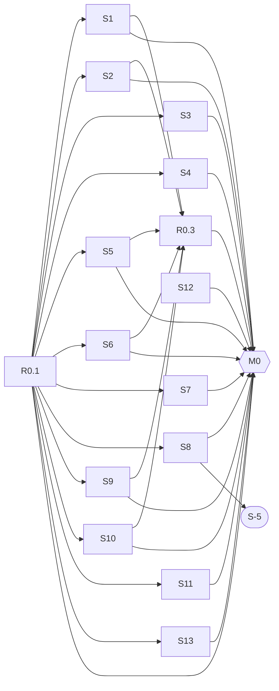
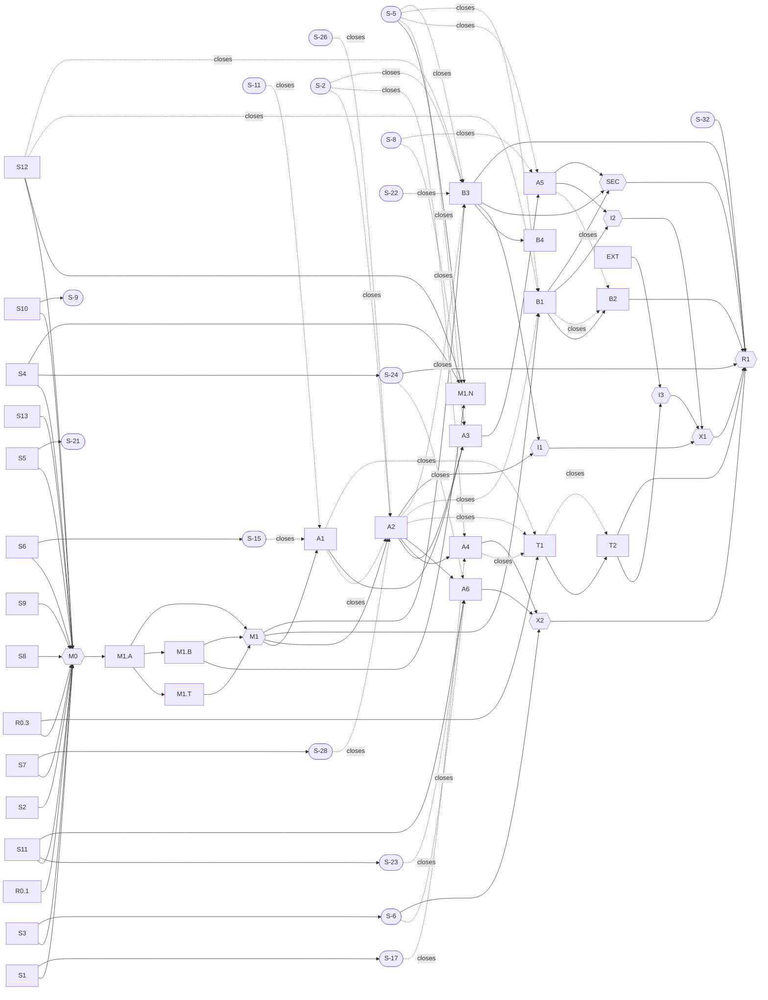

# BEES Dependency Graph

This is the [roadmap](roadmap.md) laid out as a graph, so that work can be handed to people or sub-agents
concurrently wherever nothing unmet stands in the way. It adds no decisions; where it disagrees with the roadmap,
the roadmap wins and this file is wrong. This file and [dependency-graph.yaml](dependency-graph.yaml) (the same
node list, for tooling) are generated by [gen-dependency-graph.py](gen-dependency-graph.py); edit the node list
there and re-run it.

## 1. How to read it

Every node is a piece of work with an ID from the roadmap: a spike (S1–S13), a Stage 0 deliverable (R0.x), a
stage or milestone (M0, M1, A1–A6, T1–T2, B1–B4), an integration point (I1–I3, X1–X2), a Track S item in the
Silica repository (S-n), or an external event (EXT, SEC).

Each node has three kinds of dependency:

- **Start after** (solid arrow). Hard. The node may not begin until every one of these is closed.
- **Closes only after** (dotted arrow). The node may begin, but cannot be called done until these have landed.
  Work on it proceeds on the interim the roadmap names.
- **Soft** (listed, not drawn). The node may start *and close* on the named interim; the dependency replaces the
  interim later without reopening the node.

**Rules for concurrent work:**

1. Any set of nodes whose *start after* lists are all closed may run at the same time.
2. Two concurrent nodes in the same `area` must have one owner, or agree on file ownership first. The areas are
   `contract/` (R0.3, T1, T2, S9, M1.T), `src/shim/` (M1.A, A1–A6), `src/inter_nodal/` (M1.B, M1.N, B1–B4),
   `native/` (S4, S12), `trials/` (the other spikes, S13) and `tools/` (R0.1).
3. **Track S nodes are in the Silica repository and follow Silica's `AI_POLICY.md`: human-vetted, no AI
   co-authors, smallest reasonable PRs.** A sub-agent may draft the proposal text and the failing trial in the
   BEES repository; a person files and lands the Silica change. Do not hand a Track S node to a sub-agent as
   implementation work.
4. A node is closed by trials, not by code that merely compiles (roadmap §5).
5. **S-5 is the critical path.** Whenever a choice exists, the work that shortens the path to S-5 landing (spike
   S8, then filing S-5, then offering to implement it) goes first.

## 2. Stage 0

Everything here can start now except R0.3 and M0. The thirteen spikes are independent of each other and of the
Silica prerequisites; the one soft edge is S13's exit measurement, which is better with S7's prototype.

## 3. After Stage 0

Silica items are rounded; integration points are hexagons. Dotted arrows are *closes only after*. Soft
dependencies are not drawn; they are in the table. Stage 0 nodes appear here only where a later node depends on
them directly.

## 4. Waves

Nodes grouped by the earliest wave in which they may start: the wave after every *start after* dependency has
closed, where a node closes only once its *closes only after* dependencies have closed too (shown in brackets
where that is later than its start). A wave says only what *may* run together. Track S items run in the Silica
repository on Silica's schedule, so their wave is when they can be filed, and the waves after them assume they
land in time; if one slips, everything that closes after it slips with it.

- **Wave 0:** R0.1, S12, S-26, S-2, S-29, S-3, S-11, S-8, S-22, S-31, S-32, EXT
- **Wave 1:** S1, S2, S3, S4, S5, S6, S7, S8, S9, S10, S11, S13
- **Wave 2:** R0.3, S-5, S-28, S-9, S-15, S-17, S-6, S-23, S-24, S-21
- **Wave 3:** M0, T1 (closes in wave 8)
- **Wave 4:** M1.A
- **Wave 5:** M1.T, M1.B
- **Wave 6:** M1.N, M1
- **Wave 7:** A1, A2, B1, B3
- **Wave 8:** A3, A4, A6, B2 (closes in wave 9), B4, I1
- **Wave 9:** A5, T2, X2
- **Wave 10:** I2, I3, SEC
- **Wave 11:** X1
- **Wave 12:** R1

## 5. Node table

| ID | Work | Owner | Area | Start after | Closes only after | Soft (interim) | Unblocks |
| --- | --- | --- | --- | --- | --- | --- | --- |
| **R0.1** | Repository, trial harness, bees_config skeleton | BEES | `tools` | — | — | — | S1, S2, S3, S4, S5, S6, S7, S8, S9, S10, S11, S13, M0 |
| **S1** | Spike: trait mapping (Supervisor, split gen_server, state-machine shape) | BEES | `trials` | R0.1 | — | — | R0.3, M0, S-17 |
| **S2** | Spike: cross-unit atoms | BEES | `trials` | R0.1 | — | — | R0.3, M0 |
| **S3** | Spike: actor ceiling and spawn/message cost | BEES | `trials` | R0.1 | — | — | M0, S-6 |
| **S4** | Spike: native edge (clock_gettime, poll) through spawn_dangerous | BEES | `native` | R0.1 | — | — | M0, S-24, M1.N |
| **S5** | Spike: bytes without conversion; int64/float64 comparison (open) | BEES | `trials` | R0.1 | — | — | R0.3, M0, S-21 |
| **S6** | Spike: bees_term in a region; evacuation cost | BEES | `trials` | R0.1 | — | — | R0.3, M0, S-15 |
| **S7** | Spike: exit reports to a report sink (D23) in a Silica branch | BEES+Silica | `silica` | R0.1 | — | — | M0, S-28 |
| **S8** | Spike: re-creation shapes for every native-edge flow | BEES | `trials` | R0.1 | — | — | M0, S-5 |
| **S9** | Spike: four reference lowerings | BEES | `contract` | R0.1 | — | — | R0.3, M0 |
| **S10** | Spike: BIF failure paths and the crash report | BEES | `trials` | R0.1 | — | — | R0.3, M0, S-9 |
| **S11** | Spike: balancing through migrate_actor() | BEES | `trials` | R0.1 | — | — | M0, S-23, A6 |
| **S12** | Spike: TLS engine (rustls hosted; C library on ESP32-S3; both profiles) | BEES | `native` | — | — | — | M0, M1.N |
| **S13** | Spike: lifecycle cost (supervised spawn, message copies, yield vs mailbox depth, exit through the hub) | BEES | `trials` | R0.1 | — | S7 (exit part measured without S7's report prototype) | M0 |
| **R0.3** | Contract v0 (contract/target-contract.md) | BEES | `contract` | S1, S2, S5, S6, S9, S10 | — | — | M0, T1 |
| **M0** | Stage 0 exit: all thirteen spike notes merged, S-5 filed, contract v0 reviewed | BEES | `plan` | R0.1, S1, S2, S3, S4, S5, S6, S7, S8, S9, S10, S11, S12, S13, R0.3 | — | — | M1.A |
| **S-5** | Re-creation (Recreatable trait) — THE CRITICAL PATH | Silica | `silica` | S8 | — | — | M1.N |
| **S-26** | 64-bit actor identity | Silica | `silica` | — | — | — | — |
| **S-28** | Supervisor exit reports to a report sink | Silica | `silica` | S7 | — | — | — |
| **S-2** | Runtime link | Silica | `silica` | — | — | — | — |
| **S-9** | Stopping and shutdown for ordinary actors | Silica | `silica` | S10 | — | — | — |
| **S-29** | Atom-keyed registry | Silica | `silica` | — | — | — | — |
| **S-3** | Monotonic clock and timers | Silica | `silica` | — | — | — | — |
| **S-15** | Region release inside a living actor | Silica | `silica` | S6 | — | — | — |
| **S-11** | Big integers | Silica | `silica` | — | — | — | — |
| **S-17** | State-machine behaviour trait | Silica | `silica` | S1 | — | — | — |
| **S-6** | Per-core scheduler and growable stacks | Silica | `silica` | S3 | — | — | X2 |
| **S-23** | migrate_actor() and exclusive pins on the ESP32-S3 | Silica | `silica` | S11 | — | — | — |
| **S-24** | Fifi on the ESP32-S3 | Silica | `silica` | S4 | — | — | R1 |
| **S-8** | Mailbox introspection and a dispatch tracing hook | Silica | `silica` | — | — | — | — |
| **S-21** | buf(uint8) across the FFI boundary | Silica | `silica` | S5 | — | — | — |
| **S-22** | Silica's own TCP/IP | Silica | `silica` | — | — | — | — |
| **S-31** | Run-time calling-convention check | Silica | `silica` | — | — | — | — |
| **S-32** | Silica Linux x86_64 emitter | Silica | `silica` | — | — | — | R1 |
| **M1.A** | PoC shim v0: bees_term subset, evacuation, receive helpers, bees_timer, PoC BIFs, one Supervisor mapping | BEES | `shim` | M0 | — | — | M1.T, M1.B, M1 |
| **M1.T** | PoC contract slice: reference lowerings end to end; bees_config generating module table and atom lookup | BEES | `contract` | M1.A | — | — | M1 |
| **M1.B** | PoC protocol layers over an in-process loopback transport (TRUST call path; EPMD, handshake, delivery) | BEES | `inter_nodal` | M1.A | — | — | M1.N, M1 |
| **M1.N** | PoC on real sockets: TRUST over mTLS between two BEES nodes; cleartext to an erl -sname node | BEES | `inter_nodal` | M1.B, S-5, S12, S4 | — | — | — |
| **M1** | Stage 1 exit: three programs match the BEAM; latency and memory measured; ledger updated | BEES | `plan` | M1.A, M1.T, M1.B | — | M1.N (deferred to B1 and B3) | A1, A2, B1, B3 |
| **A1** | Terms and memory | BEES | `shim` | M1 | S-11, S-15 | — | A3 |
| **A2** | Processes and signals (save queue, pdict, exit/2 via position map, exit hub, spawn supervisors, names, timers) | BEES | `shim` | M1 | A1, S-2, S-26, S-28 | S-9 (shutdown: 0, no terminate/2); S-29 (BEES name table, hub removes names); S-3 (native clock through the edge) | A3, A4, A6, I1 |
| **A3** | ERTS modules and BIFs (tiers, result-returning variants, ets, persistent_term, code, bees_log, crypto) | BEES | `shim` | A1, A2 | S-5, S-8 | — | A5 |
| **A4** | OTP behaviours on Silica constructs (Supervisor, split gen_server, state machine; proc_lib/sys support) | BEES | `shim` | A2 | S-17, S-2 | — | X2 |
| **A5** | Host I/O and observability (bees_io, bees_inet, bees_file, I/O server, telemetry) | BEES | `shim` | A3 | S-5, S-8 | S-22 (native-edge sockets) | I2, SEC |
| **A6** | Balancing and placement (bees_place, spawn supervisors, dispatch budget, watchdog, statistics) | BEES | `shim` | A2, S11 | S-6, S-23, S-24 | — | X2 |
| **T1** | Contract 1.0 (all eight items, cross-language rules, versioning) | BEES | `contract` | R0.3 | A1, A2, A4 | — | T2 |
| **T2** | Conformance kit (reference lowerings + self-check suite, packaged for compiler CI) | BEES | `contract` | T1 | T1 | — | I3, R1 |
| **B1** | TRUST 1.0 single request (trust/1 spec and codec, FSM, whitelist, tokens, suspicion, pins, audit) | BEES | `inter_nodal` | M1 | A2, S-5, S12 | S-17 (FSM as a plain behaviour with a phase field) | B2, I2, SEC |
| **B2** | TRUST windowed multiplexing | BEES | `inter_nodal` | B1 | B1, A5 | — | R1 |
| **B3** | BEAM mode L1–L2 (EPMD, handshake, ETF, links, bees_gen, tls transport, node-down by send) | BEES | `inter_nodal` | M1 | A2, S-2, S-5, S-22, S12 | — | B4, I1, SEC, R1 |
| **B4** | BEAM mode L3–L4 (remote spawn; BEES's erpc, rpc, net_kernel, global, pg) — after 1.0 | BEES | `inter_nodal` | B3 | — | — | — |
| **I1** | Remote lifecycle: A2 exits × B3 control messages | BEES | `plan` | A2, B3 | — | — | X1 |
| **I2** | Network I/O: A5 bees_io × B1 transport | BEES | `plan` | A5, B1 | — | — | X1 |
| **EXT** | External: first language-to-Silica compiler (expected Erlang) | external | `external` | — | — | — | I3 |
| **I3** | First external compiler passes the conformance kit | BEES+external | `plan` | T2, EXT | — | — | X1 |
| **X1** | Cluster semantics: three-node mixed cluster survives a partition | BEES | `plan` | I1, I2, I3 | — | — | R1 |
| **X2** | Scale: benchmarks against the BEAM, 1 million idle processes | BEES | `plan` | A6, A4, S-6 | — | — | R1 |
| **SEC** | External security review: TRUST, bees_ingress, re-creation points, native edge | external | `plan` | B1, B3, A5 | — | — | R1 |
| **R1** | Release 1.0 | BEES | `plan` | X1, X2, B2, B3, SEC, T2, S-24, S-32 | — | — | — |
