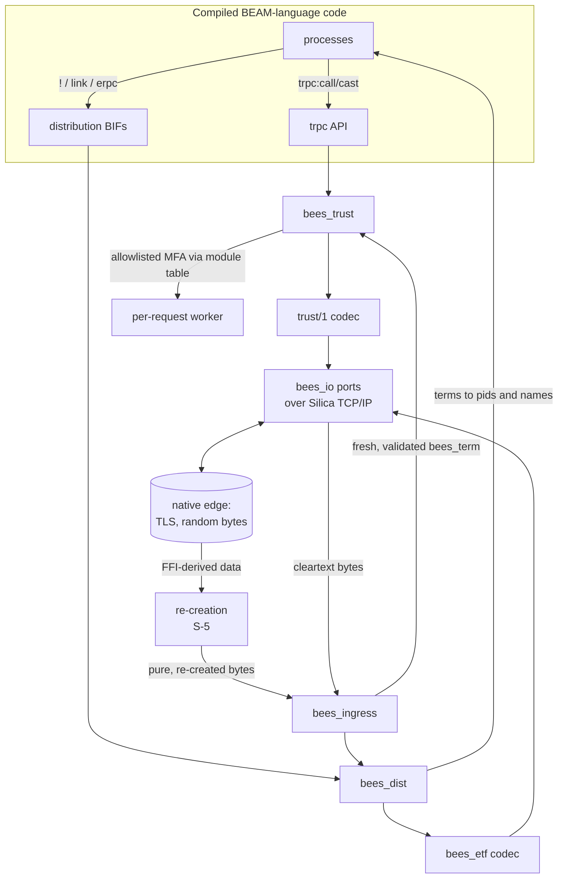
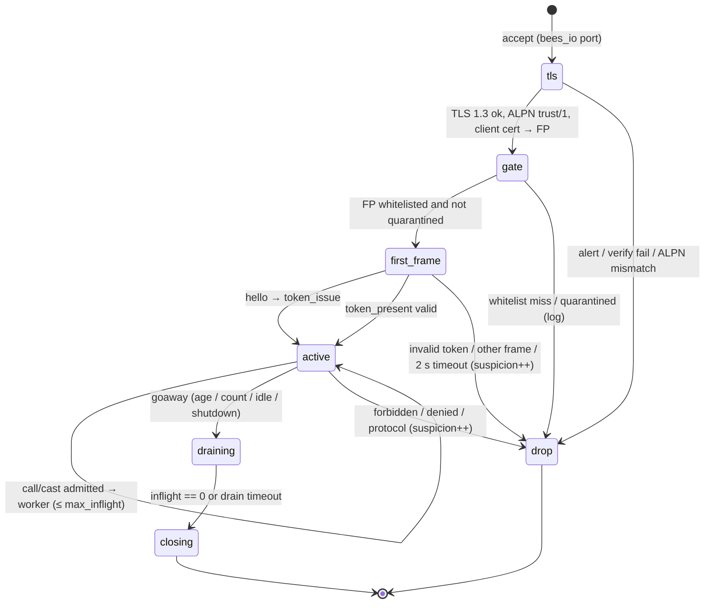

# BEES Inter-Nodal Modes: SEMP/TRUST and Standard BEAM Distribution

BEAM-language programs compiled to Silica through BEES reach other nodes in one of two modes:

| | **SEMP/TRUST** (default) | **Standard BEAM distribution** (explicit downgrade) |
| --- | --- | --- |
| Purpose | Secure-by-default service-to-service RPC between nodes | Interoperability with existing Erlang/OTP clusters, and BEAM-equivalent behaviour on trusted networks |
| Programming interface for compiled code | `trpc:call/4,5`, `trpc:cast/4,5`: the BEAM_SEMP API | The standard one: `!` to remote pids and `{Name, Node}`, links, `spawn/4`, `erpc`, `rpc`, `global`, `pg` |
| Transport | TLS 1.3 only, mTLS required, ALPN `trust/1` | TCP, optionally TLS compatible with `inet_tls_dist` |
| Peer identity | SHA-512 fingerprint of the peer certificate | `name@host` plus creation, and a shared cookie |
| Discovery | Explicit `host:port`; DNS A/AAAA only; no EPMD | EPMD (port 4369) |
| Connection model | Short-lived: one request (B1), or a bounded session window (B2) | Long-lived, full mesh, with net ticks |
| What a peer may do | Call or cast MFAs that the whitelist allows for its fingerprint and that the forbidden guard does not block. Nothing else. | What an OTP peer may do (send, link, exit), with remote spawn off unless enabled (§4.5) |
| Failure reporting to the peer | None; failures are logged locally and scored as suspicion | As in OTP: exit reasons, `noconnection` |
| Remote pids and links | No; not for 1.0 (roadmap decision D9) | Yes |

Both modes are part of Track B ([parallel-tracks.md](parallel-tracks.md)). They are milestones B1 and B2 (TRUST) and
B3 and B4 (BEAM mode) in the [roadmap](roadmap.md). SEMP/TRUST has no implementation today: the Erlang code in
`BEAM_SEMP` is the **design starting point**, and BEES is the implementation. Where that code disagrees with its own
documentation, this document follows the documentation. §3.12 lists every such discrepancy.

> **Decisions.** Every decision this document cites has been made ([roadmap §6](roadmap.md#6-decisions)).

Both modes are implemented in Silica as parts of the BEES shim. Compiled BEAM code reaches them through the usual
module names (`trpc`, and `erlang`'s distribution BIFs underneath OTP's compiled `net_kernel`, `erpc`, `global` and
`pg`), so an application written for BEAM_SEMP or for distributed Erlang keeps its source code.

---

## 1. Shared architecture



### 1.1 The remote invocation surface

Compiled BEAM code has `apply/3`. It works through the program-wide module table, which `bees_config` builds from
the dispatch entries each language compiler emits (roadmap §1, contract item 4). What a remote peer can invoke
therefore depends on the mode:

- **TRUST** follows the reference design exactly. A request names `{M, F, A}` and `Args`.
  1. The server first applies the **forbidden guard**. This is the reference implementation's default map, which
     covers code loading, ports, `apply`, `spawn*`, atom creation, `binary_to_term`, tracing, the registry, timers,
     OS and file access, sockets, and OTP behaviour entry points. BEES extends it with its own internal modules: every
     `bees_*` module, the generated module-table, atom-lookup and dispatch-entry modules, and the `trpc`, `trust_`, `semp_` and `tempus_` prefixes.
  2. It then checks the fingerprint's **permission spec**.
  3. Only then does it call the function through the module table, in a per-request worker process.

  A function that was not compiled into the executable does not exist, so the reachable set is always finite and
  known when the application is built.
- **BEAM mode** follows OTP. Messages are delivered to any pid or registered name, as they are between Erlang nodes.
  Remote spawn (SPAWN_REQUEST, which is what `erpc` and `rpc` use) is governed by the scoped `spawn` option in §4.5,
  and is off by default.

### 1.2 Re-creation and the ingress gate

BEES keeps Silica's FFI spec as written.
- FFI-derived data stays tainted however it is copied (FFI spec §7.4).
- It cannot be sent on a socket (§7.3).
- It must be consumed or discarded in the handler that receives it (§7.6).

TLS and secure random bytes come through the native edge (D17), so remote input takes one of two paths:

- **FFI-derived data** (TLS plaintext, random bytes, digests, peer-certificate data) is first **re-created** (S-5).
  - The compiler-derived `recreate` checks the declared limits, rebuilds the value in a fresh region, and rejects
    anything that does not fit its type.
  - Only the re-created value leaves the handler. TLS ciphertext bound for a socket is re-created the same way.
- **Cleartext bytes from Silica's own sockets** are untainted but untrusted.

Both then pass **`bees_ingress`**, the single path for remote input into processes. It does the protocol-level
validation that the compiler cannot do:

1. **Frame bounds come first.** Reject any length prefix above `frame_size_max`, and any argument payload above
   `args_len_max`, before decoding anything.
2. **Structural limits during decoding.** Maximum nesting depth, maximum element count per list, tuple and map,
   maximum total terms per frame, and maximum binary size.
3. **Atom policy.** BEAM atoms are Silica atoms. Silica's atom table is fixed at compile time, and BEES has no atom
   table of its own, so the gate never creates an atom. In both modes it looks each spelling up in the program's
   atom lookup (roadmap §4.6), accepts only atoms found there, and rejects a frame carrying any other atom under
   item 6 (D16).
   - In TRUST, atoms travel as spellings in the `trust/1` encoding (D8), and only spellings the atom lookup holds are accepted.
   - In BEAM mode it is a difference from OTP, which creates new atoms. An OTP peer that sends an atom the program's
     compiled code never mentions has its frame rejected.
   - Because every pid carries its node's name as an atom, **every node allowed to connect in BEAM mode must be
     named in the code** (D16). The handshake enforces this (§4.3).
4. **Type policy.**
   - TRUST accepts no pids, references, ports or funs.
   - BEAM mode accepts all of them. Local funs remain opaque, because their code is BEAM bytecode (gap ledger §5).
5. **Fresh construction.** The output `bees_term` is built from new Silica values in the gate's own short-lived
   worker.
6. **Silent failure toward the peer.** Any violation drops the frame and closes the connection according to the
   mode's rules, and writes an audit entry. In TRUST it also applies a suspicion increment.

The gate is small, has no bypass, and is fuzzed per validator. The external security review covers it.

### 1.3 Configuration

Configuration is a standard `sys.config`. It is read at boot into the application environment that compiled code
reads with `application:get_env`, so the BEAM_SEMP README's configuration example stays valid. Validation is
fail-fast: an invalid value aborts boot with a clear error, and values are never clamped, as the multiplexing design
requires.

BEES reads `sys.config` at boot with its own small reader for Erlang term text, because configuration must be
available before any compiled OTP code (such as `erl_parse`) is running.

```erlang
[
  {trust, [                                   %% on by default
    {port, 6464},
    {tls_opts, [{certfile,   "certs/node.pem"},
                {keyfile,    "certs/node-key.pem"},
                {cacertfile, "certs/ca.pem"}]},
    {whitelist_file, "trust_whitelist.config"},   %% server side: cert file => permission spec
    {server_pins_file, "trust_servers.config"},   %% client side (§3.3), new relative to the reference
    {whitelist_default_spec, none},
    {call_timeout_ms, 5000},
    {suspicion_limit, 3},
    {token_ttl_sec, 300},
    {session, #{max_inflight => 8, max_age_ms => 60000, idle_ms => 5000,
                max_calls => 100, drain_ms => 1000}}   %% B2; all 1 reproduces B1
  ]},
  {bees_dist, [                               %% standard BEAM mode; off by default
    {enabled, false},
    {sname, "orders"},
    {cookie_file, "secrets/erlang.cookie"},
    {transport, tls},                         %% tcp | tls
    {spawn, none},                            %% none | allowlist | any
    {spawn_allowlist, []}
  ]}
].
```

---

## 2. Mode selection

- **TRUST is on by default.** A node with no whitelist file accepts no inbound TRUST connections, but can still act
  as a client. The reference calls this "standalone."
- **BEAM mode is off by default** (roadmap D7). Enabling it:
  - starts a separate listener;
  - prints a downgrade banner at boot and then periodically;
  - tags every BEAM-mode log line and telemetry event with `mode=beam`.

  While it is off, the distribution BIFs behave as they do on a non-distributed Erlang node: `node()` is
  `nonode@nohost`, and remote sends fail as they do there. Nothing is killed at run time, unlike `semp_kill_it_all`
  in the reference, because the listener was never started.
- **Both modes may run on one node at once.** They share the module table, but each mode has its own guard: TRUST
  has its whitelist and forbidden guard, BEAM mode its `spawn` option.
- **Downgrades are scoped.** BEAM mode's options (§4.5) each relax one property. TRUST has no downgrade options: it is
  either on or off.

---

## 3. SEMP/TRUST

TRUST is the part of SEMP for stable, long-lived nodes. TEMPUS, the part for ephemeral peers, is post-1.0 (§5).

### 3.1 Guarantees

1. Every connection is TLS 1.3 with mTLS, and **both** sides verify the other side's fingerprint (§3.3).
2. A peer can invoke only the MFAs its whitelist entry allows, minus the forbidden guard.
3. No failure detail ever leaves the node. A successful call gets a `result` frame; a successful cast gets nothing;
   everything else closes the connection with no error body.
4. Misbehaviour is scored per fingerprint. Crossing the limit quarantines the peer until an operator resets it.
5. Every connection's resources are bounded: frame sizes, requests in flight, session age and idle time.

### 3.2 TLS profile

TRUST adopts the locked profile from Silica's `tls_quantum_safe_future.md` §4, so that the native edge can later be
replaced by Silica TLS intrinsics (S-13) without a wire change.

- TLS 1.3 only.
- ALPN must be `trust/1`; anything else closes the connection.
- Key exchange: hybrid X25519MLKEM768. Classical-only groups are refused.
- Ciphers: AES-256-GCM or ChaCha20-Poly1305.
- Certificates: Ed25519 or ECDSA P-256. Client certificates are required.
- No 0-RTT, no renegotiation, no compression.
- The client CA must be configured explicitly; there is no implicit system trust store.


### 3.3 Identity and whitelists

- **Fingerprint**: FP = SHA-512 of the peer certificate's full DER (D11), computed in the native edge and re-created (S-5).
- **Server-side whitelist** (`whitelist_file`): certificate file → permission spec, exactly as the reference
  implementation reads it. Each certificate is loaded and fingerprinted at boot. A missing file is logged and
  skipped. The permission specs are:
  - `none`: the handshake succeeds but nothing is permitted. This is the default.
  - `any`: any MFA the forbidden guard allows. Discouraged.
  - a per-module list: `[{Module, any} | {Module, [{Function, Arity}]}]`.
- **Client-side pins** (`server_pins_file`, new relative to the reference): a TRUST client accepts a server only if
  its fingerprint is pinned for the address being dialled. The reference client relied only on the CA chain.
- **One certificate per node.** A shared certificate collapses identity and makes suspicion scoring meaningless. Boot
  warns when two whitelist entries share a fingerprint.

### 3.4 Executing MFAs

| Step | Reference implementation | BEES |
| --- | --- | --- |
| Argument count | `length(Args) =:= A` | Same, checked in `bees_ingress` before any other step |
| Forbidden guard | `semp_policy` default map plus internal prefixes | The same map, extended with BEES's internal modules (§1.1) |
| Permission gate | Whitelist spec for the fingerprint | Same |
| Execution | `apply(M, F, Args)` in the connection process | The module-table call, in a **per-request worker process**. That satisfies roadmap §4.2 (the garbage dies with the worker) and matches the multiplexing design's worker-per-request shape. |
| User code raises an exception | An error frame is sent (a defect) | The worker fails (D2), and its supervisor reports the exit (D23). The connection FSM logs `user_code_error` and counts it as suspicion. **No** frame is sent (§3.12 item 1). |

### 3.5 Tokens

- 48 random bytes by default (configurable from 32 to 64), from the native edge's secure random source and re-created (S-5), stored **per peer fingerprint** with
  an expiry. There is one token per fingerprint; a new one overwrites the old.
- Held in memory only, so a server restart invalidates every token. This is intended.
- Compared in constant time in the native edge until S-14. The result only decides accept or reject inside the handler, so it needs no re-creation.
- Revoked on quarantine.
- The client caches tokens per **server** fingerprint and presents one only to that server.
- The default TTL is unified to **300 s** (§3.12 item 5).

**What a token buys.** In the reference implementation, the whitelist and suspicion checks run on every connection
whether or not a token is presented. The token saves only the `token_issue` frame. For B1, BEES keeps that meaning: a
token proves a recent full-path admission, and both checks run every time because they are cheap lookups. B2
multiplexing is the real answer to handshake cost. TLS 1.3 session resumption is still an open question, to be
decided on B1's latency numbers. If allowed, it would use single-use, short-lived tickets bound to the peer
fingerprint, and still no 0-RTT.

### 3.6 The `trust/1` wire protocol

Each frame is a 4-byte big-endian length followed by a payload in the **`trust/1` term encoding** (D8). That is a
compact format made for TRUST, not ETF. It carries integers, floats, binaries, atoms by spelling (existing atoms only,
D16), lists, tuples and maps, and nothing else: no pids, references, ports or funs. B1 defines its exact bytes. Every payload is a map with a `t` key. The top-level keys `t` and `ver` (currently `1`)
are required. Unknown top-level keys are ignored. An unknown `t` is a protocol error.

| `t` | Direction | Fields | Notes |
| --- | --- | --- | --- |
| `hello` | client → server | `ver` | **New.** A client with no token sends `hello` immediately. The reference server waited 2 s for silence instead (§3.12 item 3). |
| `token_present` | client → server | `ver`, `token` | The fast path. |
| `token_issue` | server → client | `ver`, `token` | The reply to `hello`. |
| `call` | client → server | `ver`, `req_id`, `m`, `f`, `a`, `args`, `opts` | `req_id`: at most 16 bytes, unique among this client's requests in flight on the connection. `opts` may carry `deadline_ms`. An `m` or `f` that is not an existing atom cannot name a compiled function, so it is denied. |
| `cast` | client → server | same as `call` | Never answered. |
| `result` | server → client | `ver`, `req_id`, `value` | Successful calls only. Under B2, results may arrive out of order. |
| `goaway` | server → client | `ver`, `reason`, `drain_ms` | B2 only. `reason` is one of `limit_reached`, `shutdown`, `deny`, `protocol`. |

This is the per-connection server state machine. It is implemented on Silica's state-machine trait (S-17); until that
trait lands, it is a plain behaviour with an explicit phase field.



With the B2 limits all set to 1, `active` admits exactly one request and then closes. That is B1 behaviour, as
requirement R-6 of the multiplexing design specifies.

### 3.7 Suspicion and quarantine

- Every fingerprint has a counter, seeded at 0 from the whitelist at boot. An unknown fingerprint is never trusted.
- **Increments:** protocol violations, forbidden or denied MFAs, invalid tokens, user code errors, timeouts (a soft
  increment), and B2 GOAWAYs sent with reason `deny` or `protocol`.
- **Decrements:** each successful permitted request (floor 0).
- **Quarantine:** when the counter exceeds `suspicion_limit`, the fingerprint is quarantined, its token is revoked, and
  all its connections are refused.
- Recovery is **only** by an operator reset (D10), through a local-only administration function that the forbidden
  guard always blocks for remote peers.
- Every change emits an audit event (§3.11).

### 3.8 Limits and timeouts

Where the SEMP README and the multiplexing design disagree, BEES uses the multiplexing design's values, which are
newer and more conservative. All values are validated at boot.

| Setting | Default | Bounds |
| --- | --- | --- |
| DNS resolve | 2 s per name server, 5 s total | — |
| TCP connect | 3 s per address, 250 ms stagger | — |
| TLS handshake | 5 s | 1–30 s |
| First frame after TLS | 2 s | 0.1–10 s |
| `call_timeout_ms` | 5000 | 1–600,000 |
| `frame_size_max` | 1 MiB | 64 KiB–8 MiB |
| `args_len_max` | 64 KiB | 0–`frame_size_max` |
| Term nesting depth | 32 | 1–128 (new: a `bees_ingress` limit) |
| Token size, TTL | 48 B, 300 s | 32–64 B, 10–3600 s |
| Session: `max_inflight`, `max_age_ms`, `idle_ms`, `max_calls`, `drain_ms` | 8, 60,000, 5,000, 100, 1,000 | As in the multiplexing design doc; `idle_ms ≤ max_age_ms`; effective drain = `min(drain_ms, idle_ms)` |

### 3.9 Client flow and API

`trpc:call(HostOrIP, Port, {M,F,A}, Args[, Opts])` and `trpc:cast(...)` keep the BEAM_SEMP signatures and return
values:

- `{ok, Value}`, or `{ok, cast}` for a cast;
- `{error, dns_error | connect_failed | closed | timeout | protocol_error | server_not_pinned}`.

Because the server never explains a refusal, `closed` covers every refusal. `server_not_pinned` is new.

1. Resolve the host to A/AAAA records.
2. Connect to each address in turn, with the stagger.
3. TLS 1.3 handshake; check that the server's fingerprint is pinned for this address.
4. Send `token_present` with a cached token for that fingerprint, or `hello`; cache the `token_issue` reply.
5. Send `call` or `cast`. For a call, wait for `result` until the timeout.
6. Under B2, reuse the session until a `goaway` arrives.
   - `limit_reached` or `shutdown`: open a new session.
   - `deny` or `protocol`: stop, and do not retry until the cause is fixed.
   - Reconnect with exponential backoff and jitter (base 100–500 ms, cap 5 s).

### 3.10 Windowed multiplexing (B2)

The multiplexing design document maps onto BEES components as follows:

| Design element | BEES realization |
| --- | --- |
| `trust_listener_sup` acceptor pool | Accept on the listener port in `bees_io`; acceptor count from configuration |
| `trust_conn_sup` (DynamicSupervisor) | Silica `Supervisor`, `:one_for_one`, with dynamic children through `call_supervisor` `:add_child` |
| `trust_conn_fsm` (gen_statem) | Silica's state-machine trait (S-17), §3.6 |
| `trust_conn_worker_sup`, temporary `trust_rpc_worker` | A per-connection Silica `Supervisor` with `restart: :temporary` children, one per request |
| Worker `'DOWN'` → `inflight--` | No monitors (D20). A worker casts its completion to the connection FSM, and a worker that crashed shows up in the per-connection supervisor's `count_children`. |
| Pause reads when `inflight == max_inflight` | Leave the `bees_io` port un-armed (`{active, once}` not re-armed): Option A, no user-space queue |
| `state_timeout` for idle; `send_after` for maximum age | State-machine timeouts; `bees_timer` |
| Cancel by close (`kill_workers`) | Client close → terminate the per-connection supervisor with reason `client_cancel`; no suspicion increment |
| `logger` and `telemetry` events | Compiled OTP `logger` with BEES back ends, and `bees_telemetry`; event names unchanged |

The design doc's acceptance criteria 1–10 become the B2 trial suite.

### 3.11 Observability and audit

- Every state change named in the SEMP README and the multiplexing design is logged:
  - `whitelist_reject`, `quarantined`, `token_reject`, `protocol_error`, `permission_denied`, `forbidden_mfa`,
    `user_code_error`;
  - timeouts, tagged by stage;
  - `alpn_mismatch`, `tls_verify_failed`, `goaway`, `session.start`, `session.end`.
- Log lines carry the peer fingerprint (hex, truncated in normal logs and full in audit logs), the connection ID, and
  `m`/`f`/`a`.
- Logs **never** contain arguments or tokens.
- The telemetry events and metrics are the ones the multiplexing design doc lists.

### 3.12 Reference implementation behaviour that BEES does not reproduce

The Erlang code in `BEAM_SEMP` is a starting point. The following parts of it contradict its own documentation or
are defects. BEES implements what the documentation intends.

1. **An error frame is sent on a failed call.** `trust_conn:handle_mfa` calls `send_error_frame` on a user-code
   exception, which contradicts "no error details returned." BEES sends nothing.
2. **The client's token fast path never works.** `trpc:cache_token` inserts `{FP, Token}` but `trpc:token_for`
   matches `[{Token}]`. BEES caches tokens per server fingerprint, with an expiry.
3. **Token issue depends on a timeout.** The server waits `first_frame_timeout_ms` (2 s) of silence before issuing a
   token, so every first connection is 2 s slow. BEES adds an explicit `hello` frame.
4. **The client does not verify the server's identity beyond the CA.** BEES adds client-side pins (§3.3).
5. **Configuration defaults are inconsistent.**
   - Token TTL: 1200 s in `semp.hrl`, 120 s in `trust_token`, and 300 s in the README example.
   - Frame limit: 8 MiB in the README, 1 MiB in the multiplexing doc.
   - `suspicion_limit` is read from the `semp` application; everything else is read from `trust`.

   BEES uses the values in §3.8 and reads everything from the `trust` application.
6. **Recovery from quarantine is contradictory.** The README says both "self-healing" and "out-of-system reset."
   D10 settles it: an operator reset only.
7. **The whitelist key is described two ways** (TBSCertificate versus full DER). D11 settles it: the full DER.
8. **Standard distribution is disabled by tracing.** `semp_kill_it_all` stops standard distribution by tracing `rpc`
   and `erpc` and killing the callers. BEES never starts BEAM mode unless it is configured (§2).

### 3.13 Clients

There will be no Erlang clients (D8), so `trust/1` makes no attempt to stay readable by Erlang SEMP nodes, and BEES
does not reproduce the reference implementation's wire. A language-neutral `trust/1` specification, covering the
frames, the term encoding and the TLS profile in §3.2, is a B1 deliverable. Any client, in any language, can then be
built from it.

---

## 4. Standard BEAM distribution

### 4.1 Purpose and stance

This mode lets compiled BEAM-language programs on BEES join Erlang/OTP clusters, and reproduces the BEAM's security
posture when an operator deliberately wants it. It is a **downgrade**, as parallel-tracks.md describes under
"Opting down to BEAM-equivalent security": off by default, explicit, scoped, and loudly logged.

### 4.2 Compatibility levels

| Level | Capability | Milestone |
| --- | --- | --- |
| **L1 Messaging** | EPMD registration and lookup; the handshake; ticks; sending to remote pids and to `{Name, Node}`, in both directions | Stage 1 (partial), B3 |
| **L2 Lifecycle** | LINK, UNLINK_ID and its acknowledgement, EXIT and EXIT2. `noconnection` is delivered to every link that crosses a lost connection. Monitor requests from OTP peers (`MONITOR_P`, `DEMONITOR_P`) are dropped silently, and `MONITOR_P_EXIT` is never sent (D21). A `gen_server:call` from an Erlang node still gets its reply, but if the BEES process dies mid-call, the caller waits for its timeout. Compiled code has no monitors (D20). | B3, I1 |
| **L3 Remote execution** | SPAWN_REQUEST and SPAWN_REPLY, so compiled `erpc` and `rpc` work in both directions, subject to the `spawn` option | B4 (after 1.0) |
| **L4 Cluster services** | TLS distribution compatible with `inet_tls_dist`; `global` and `pg`, compiled from OTP | B4 (after 1.0) |

Exit signals crossing a node boundary follow D18.
- An `EXIT2` arriving from an Erlang node becomes an exit request to the target's supervisor, exactly as a local
  `exit/2` does. A remote link that fires is handled the same way on the receiving node.
- Compiled code on BEES sees Silica's own failure shapes and atom reasons. BEES translates reasons to and from Erlang
  terms on the wire, so OTP peers still receive well-formed `EXIT` and `DOWN` control messages.

### 4.3 Protocol components

- **EPMD client:** ALIVE2 registration and PORT_PLEASE2 lookup. An optional BEES EPMD server is provided for hosts
  with no Erlang installed.
- **Handshake:** the OTP 23+ (version 6) handshake.
  - **Peer names are an allowlist fixed at build time** (D16). The peer's node name arrives as text in its first
    handshake message. If the program's atom lookup does not hold that name as an atom, BEES answers with the
    `not_allowed` status and closes the connection. Adding a peer means rebuilding the program. The BEES node's own
    name must also be in the code.
  - The challenge is random bytes from the native edge. The digest is MD5 over the cookie followed by the challenge. Both are re-created (S-5) before they are written to the socket, which is Silica's own (S-22).
  - The cookie is read from `cookie_file`. It is never read implicitly from `~/.erlang.cookie`, and it is never
    logged.
  - Capability flags: advertise exactly what BEES implements, plus the flags the targeted OTP releases make mandatory
    (for example: extended pids and references, UTF-8 atoms, maps, big creation, handshake-23, and from OTP 26
    `DFLAG_V4_NC` and `DFLAG_UNLINK_ID`). The exact set is verified per release in the interop matrix.
- **Framing:** 4-byte length packets; a zero-length packet is a tick. Control messages use pass-through encoding (no
  atom-cache distribution header), unless a release in the matrix requires the atom cache.
- **ETF:** decoded through `bees_ingress` into ordinary `bees_term` values, so received messages are indistinguishable
  from local ones:

  | ETF value | `bees_term` |
  | --- | --- |
  | Integers | Small integers; big integers once Silica has them (S-11), and until then any value outside `int64` closes the connection with an audit entry |
  | `NEW_FLOAT_EXT` | `float64`, decoded in Silica through lookups and exact float arithmetic, with no bit-cast (roadmap §4.5) |
  | Atoms | The Silica atom that the atom lookup holds for that spelling; a spelling the lookup does not hold is rejected (§1.2) |
  | Binaries, bitstrings | Binaries and bitstrings |
  | Tuples, lists, maps | The corresponding terms |
  | Pids | The node plus the pid's 64-bit identity (D22). Pids from Erlang nodes keep their own id, serial and creation. A BEES identity is a fixed 64-bit value (D22), so it goes on the wire directly: the high 32 bits as `NEW_PID_EXT`'s id and the low 32 bits as its serial. |
  | References, ports | Remote references and ports, carrying their node |
  | Export funs (`fun M:F/A`) | Fun terms that run through the module table |
  | Local funs | Opaque terms; calling one raises `badfun` (gap ledger §5) |

- **Node connections:** one connection process per peer node. It learns of local deaths from the exit hub (D23). It owns the socket through `bees_io`, the tick timer,
  and the set of links that cross that connection, so that losing the connection fires all of them.

### 4.4 Delivery

Compiled BEAM code is dynamically typed, so a remote message is delivered exactly as a local one: to the destination
pid, or to the process registered under the destination name. Sends to unknown or dead destinations are dropped
silently, as on the BEAM. Native Silica actors that are not compiled BEAM code do not accept `bees_term` messages,
so they cannot be reached from BEAM mode unless an application wraps them in a compiled process.

### 4.5 Scoped downgrade options

| Option | Values | Default when BEAM mode is enabled |
| --- | --- | --- |
| `transport` | `tcp` (cleartext, full BEAM parity) or `tls` (compatible with `inet_tls_dist`) | `tls` |
| `spawn` | `none`, `allowlist` (only MFAs in `spawn_allowlist`), or `any` (BEAM parity) | `none` |
| `auth` | `cookie` only; there is nothing weaker | `cookie` |

BEAM-mode TLS uses a **compatibility profile** (TLS 1.3, X25519, ECDSA or RSA certificates) so that stock OTP
`inet_tls_dist` can connect. It is weaker than the TRUST profile in §3.2, and is documented as part of the downgrade.

### 4.6 Interoperability test matrix

The BEES trial tree covers every combination of:

- the OTP release named in D14 (more releases may be added, but 1.0 promises only that one);
- levels L1 and L2 (L3 and L4 join after 1.0);
- `tcp` and `tls`;
- both connection directions: BEES dials Erlang, and Erlang dials BEES.

It also includes partition trials: kill the peer node, then check `nodedown` and `noconnection` delivery on each side.
The README's compatibility statement is generated from this matrix, which gives the README the tested guarantee it
requires.

---

## 5. TEMPUS (post-1.0)

TEMPUS is SEMP's layer for ephemeral peers. Its design is in the `BEAM_SEMP` README. **TRUST is built first, and
TEMPUS is added afterwards as a layer on top of it** (D12). TEMPUS reuses TRUST's TLS transport, framing, term
encoding and `bees_ingress` path, and adds membership and admission for peers that come and go.

One design point to settle when TEMPUS work starts: ephemeral peers can't be listed in TRUST's certificate whitelist
in advance. So for TEMPUS traffic, admission through producer tokens and proof of possession has to stand in for
the whitelist lookup, while TRUST's other rules stay in force.

When work begins, BEES maps TEMPUS as follows:

- **Three isolated Cyclon stores** (`tempus_edge`, `tempus_bridge`, `tempus_sentinel`). Each is a process on Silica's
  gen_server trait, holding its view in a term map keyed by peer ID, with a shuffle tick from `bees_timer`. Stores
  never exchange entries.
- **Ed25519 per-install identity, verification of producer-signed tokens, proof of possession.** Ed25519 runs in the
  native edge, and tokens are parsed through `bees_ingress`. Key rotation is strict and non-overlapping, pinned by
  `kid`.
- **Platform attestation** (App Attest, Play Integrity) belongs to the issuer backend. BEES nodes only verify the
  resulting tokens.
- **Bridges to TRUST.** A `tempus_bridge` peer is also a TRUST node with a whitelisted certificate. Bridging is
  application logic, as the SEMP design says.
