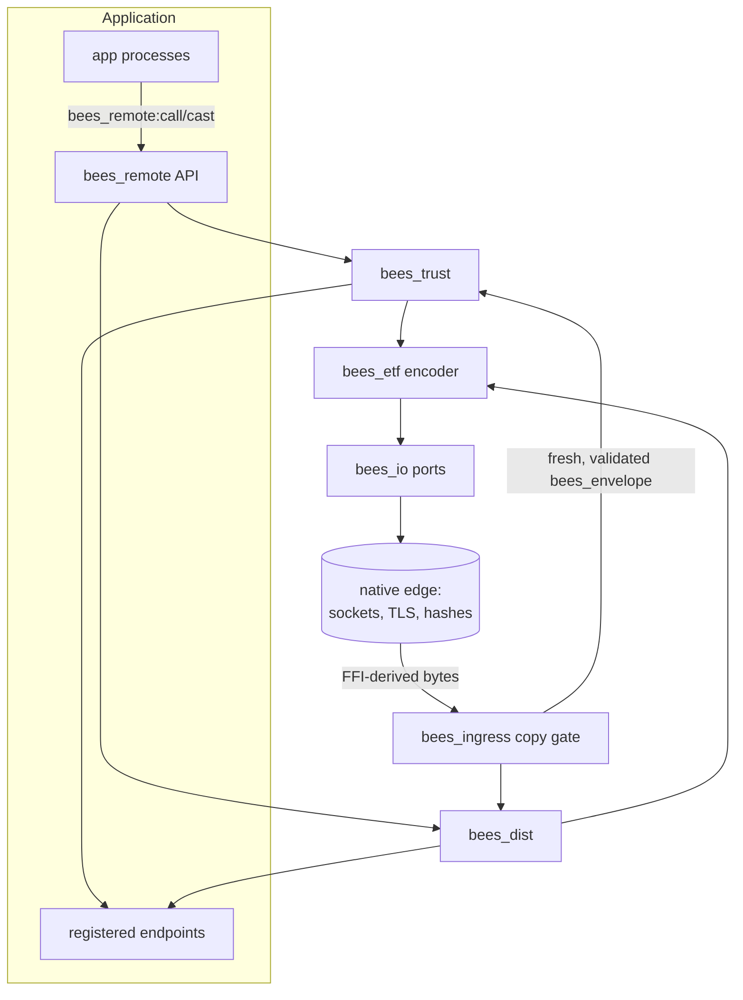
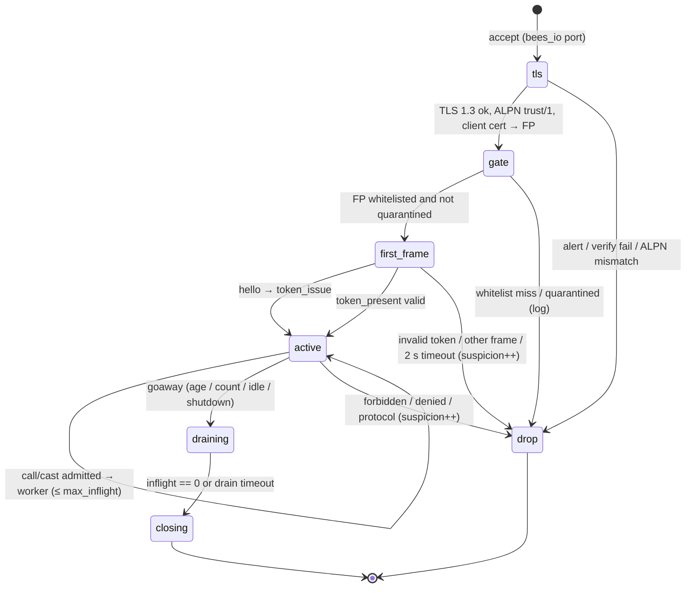

# BEES Inter-Nodal Modes: SEMP/TRUST and Standard BEAM Distribution

BEES nodes connect to other nodes in one of two modes:

| | **SEMP/TRUST** (default) | **Standard BEAM distribution** (explicit downgrade) |
| --- | --- | --- |
| Purpose | Secure-by-default service-to-service communication between BEES nodes, and with any other `trust/1` implementation | Interoperability with existing Erlang/OTP clusters; BEAM-equivalent posture on trusted networks |
| Transport | TLS 1.3 only, mutual TLS (mTLS) required, ALPN `trust/1` | TCP, optionally TLS compatible with `inet_tls_dist` |
| Peer identity | SHA-512 fingerprint of the peer certificate | `name@host` plus creation; shared cookie |
| Discovery | Explicit `host:port`; DNS A/AAAA only; no EPMD | EPMD (port 4369) |
| Connection model | Short-lived: one request (B1), or a bounded session window (B2) | Long-lived, full mesh, with net ticks |
| What a peer may do | Call or cast **registered endpoints** listed for its fingerprint, and nothing else | Send to exported names and to BEES pids it has been given; link, monitor, exit; spawn on exported endpoints (B4) |
| Failure reporting to the peer | None; failures are logged locally and scored as suspicion | As OTP (exit reasons, `noconnection`) |
| Remote pids, links, monitors | No (see D5 in the roadmap) | Yes |

Both modes are **implementations of Track B**, as defined in [parallel-tracks.md](parallel-tracks.md). The milestones
are B1 and B2 (TRUST) and B3 and B4 (BEAM mode) in the [roadmap](roadmap.md). SEMP/TRUST has no implementation today:
the Erlang code in `BEAM_SEMP` is the **design starting point**, and BEES is the implementation. Where that code
disagrees with its own documentation, this document follows the documentation, and §3.12 lists every such
discrepancy.

---

## 1. Shared architecture



### 1.1 The endpoint registry is the only authority surface

Silica has no `apply/3`, and BEES does not add one. In both modes, anything a remote peer can reach is an
**endpoint** that the host application registered explicitly:

```
{ name: { module: string, function: string, arity: uint64 },
  kind: :call | :cast | :spawnable | :named_process,
  handler: actor_ref,          // a BEES process that accepts bees_envelope
  modes: :trust | :beam | :both }
```

- The handler receives a `bees_envelope` whose `body` is a `bees_term`, and decodes it into its own statically
  typed message. That decode is the endpoint's schema check.
- Names starting with `bees_`, `trust_`, `semp_`, `tempus_` or `dangerous_` cannot be registered. This keeps the
  reference implementation's "forbidden internal namespaces" rule.
- The rest of the reference implementation's forbidden list (`erlang:apply`, `code:*`, `os:*`, sockets, and so on)
  has no BEES equivalent, because those functions are not reachable unless an application deliberately registers an
  endpoint that wraps them. Least authority holds by construction rather than by a deny list.

### 1.2 The copy gate

Every byte from the network arrives through the native edge (roadmap §4, items 6 and 7). FFI-derived data may be
copied and the copy sent, but it may never be sent directly. `bees_ingress` is the single place where that copy
happens, and it carries the safeguards:

1. **Frame bounds before anything else.** Reject any length prefix above `frame_size_max`, and any argument payload
   above `args_len_max`, before decoding.
2. **Structural limits during decoding.** Maximum nesting depth, maximum element count per list, tuple and map,
   maximum total terms per frame, maximum string length.
3. **Type rules.** Atoms arrive as strings and are never interned. Tags outside the mode's accepted set are rejected:
   TRUST accepts only the ETF subset in D4, while BEAM mode also accepts pids, references, ports, bignums and
   bitstrings, the last four as opaque values. Funs are rejected. UTF-8 is validated where the protocol requires
   text.
4. **Fresh construction.** The output `bees_envelope` and `bees_term` are built from new Silica values in the gate's
   own short-lived worker, so no native-edge bytes survive into the copy.
5. **Silent failure toward the peer.** Any violation drops the frame and closes the connection according to the mode's
   rules. It also writes an audit log entry and, in TRUST, a suspicion increment.

The gate is small, has no bypass, and is fuzzed per validator. The external security review covers it.

### 1.3 Node configuration

BEES has no Erlang `sys.config`. A node reads one text configuration file named at boot, using Silica's
`read_lines`. The format is line-oriented so that it parses with Silica string operations. Validation is fail-fast:
any invalid value aborts boot with a clear error, and values are never clamped, as the multiplexing design requires.

```
[node]
name            = orders-1

[trust]                                  # on by default
enabled         = true
port            = 6464
cert            = certs/orders-1.pem
key             = certs/orders-1-key.pem
client_ca       = certs/ca.pem
peers_file      = trust_peers.conf       # whitelist: certificate file -> permitted endpoints
servers_file    = trust_servers.conf     # client-side pins (§3.3)
suspicion_limit = 3
token_ttl_s     = 300

[trust.session]                          # B2; all values 1 reproduces B1 exactly
max_inflight = 8
max_age_ms   = 60000
idle_ms      = 5000
max_calls    = 100
drain_ms     = 1000

[beam]                                   # off by default; enabling it is a logged downgrade
enabled   = false
sname     = orders
cookie_file = secrets/erlang.cookie
transport = tcp                          # tcp | tls
spawn     = none                         # none | exported
```

---

## 2. Mode selection

- **TRUST is on by default.** A node with no `[trust]` peers file accepts no inbound TRUST connections but can still
  act as a client. The reference implementation called this "standalone."
- **BEAM mode is off by default** (roadmap decision D3). Enabling it:
  - starts a separate listener;
  - prints a downgrade banner at boot, and then again every `beam.banner_interval_s`;
  - tags every BEAM-mode log line and telemetry event with `mode=beam`.
- **Both modes may run on one node at the same time.** They share the endpoint registry, but an endpoint is reachable
  from a mode only if its `modes` field includes that mode.
- **Downgrades are scoped.** BEAM mode's own options (`transport`, `spawn`, `exit2`, `global`) each relax one property
  (§4.5). TRUST has no downgrade options: it is either on or off.

---

## 3. SEMP/TRUST

TRUST is the part of SEMP for stable, long-lived nodes. TEMPUS, the part for ephemeral peers, is post-1.0 (§5).

### 3.1 Guarantees

1. Every connection is TLS 1.3 with mTLS, and **both** sides verify the other's fingerprint (§3.3).
2. A peer can reach only endpoints that the whitelist grants to its fingerprint.
3. No failure detail ever leaves the node. A successful call gets a `result` frame; a successful cast gets nothing;
   everything else closes the connection with no error body.
4. Misbehaviour is scored per fingerprint; crossing the limit quarantines the peer until an operator resets it.
5. Every connection's resources are bounded: frame sizes, requests in flight, session age, and idle time.

### 3.2 TLS profile

TRUST adopts the locked profile from Silica's `tls_quantum_safe_future.md` §4, so that the native edge can later be
replaced by Silica TLS intrinsics (Track S item S-13) without a wire change:

- TLS 1.3 only. ALPN must be `trust/1`; any other value closes the connection.
- Key exchange: hybrid **X25519MLKEM768**. Classical-only groups are refused.
- Cipher suites: AES-256-GCM or ChaCha20-Poly1305.
- Certificates: Ed25519 or ECDSA P-256. Client certificates are required.
- No 0-RTT, no renegotiation, no compression.
- The CA used to verify client certificates must be configured explicitly; there is no implicit system trust store.

Interop note: an Erlang SEMP client must negotiate the same group. Which OTP releases support X25519MLKEM768 is an
item to verify in the B1 interop tests.

### 3.3 Identity and whitelists

- **Fingerprint**: FP = SHA-512 of the peer certificate's full DER (roadmap D7), computed in the native edge.
- **Server-side whitelist** (`peers_file`): certificate file → permission spec. Each file is loaded and
  fingerprinted at boot; a missing file is logged and skipped, as in the reference implementation. The permission
  specs are:
  - `none`: the handshake succeeds but no endpoint is permitted. This is the default.
  - `any`: any registered endpoint whose `modes` include TRUST. Discouraged, but it is not an escape hatch, because
    endpoints are an allowlist already.
  - an explicit list of `module:function/arity` endpoint names.
- **Client-side pins** (`servers_file`), which are new relative to the reference implementation: a TRUST client
  accepts a server only if the server's fingerprint is pinned for the address being dialled. The reference client
  checked only the CA chain. Both directions are now explicit.
- **Uniqueness**: one certificate per node. A shared certificate collapses identity and makes suspicion scoring
  meaningless. This is documented as an operator requirement, and boot logs a warning when two whitelist entries
  have the same fingerprint.

### 3.4 Endpoints instead of MFAs

| Reference implementation | BEES |
| --- | --- |
| The request names `{M, F, A}`; the server runs `apply(M, F, Args)` | The request names an endpoint `module:function/arity`; the server delivers a `bees_envelope` to the registered handler process |
| A forbidden-MFA deny list is checked before permissions | Registration forbids internal namespaces; nothing else is reachable anyway |
| Arity is checked by comparing `length(Args)` with `A` | Arity is part of the endpoint name, and the argument count is checked in the copy gate |
| User code raises an exception | The endpoint's handler process dies. The worker sees the death result, logs `user_code_error`, and increments suspicion. **No** error frame is sent (§3.12 item 1). |

### 3.5 Tokens

- 48 random bytes by default (configurable from 32 to 64), from the native CSPRNG, stored **per peer fingerprint**
  with an expiry. There is one token per fingerprint, and a new one overwrites the old.
- Held in memory only, so a server restart invalidates every token; this is intended.
- Compared in constant time, in the native edge until Silica's `CtMask` arrives (S-14).
- Revoked when the peer is quarantined.
- The client caches tokens per **server** fingerprint and presents one only to that server.
- The TTL default is unified to **300 s**. The reference implementation had three different values (§3.12 item 5).

**What a token buys.** In the reference code, the whitelist and suspicion checks run on every connection whether or
not a token is presented, so the token saves only the `token_issue` frame. For B1, BEES keeps those semantics: a
token is proof of a recent full-path admission, and whitelist and suspicion are always re-checked because they are
cheap lookups. B2 multiplexing is the real answer to handshake cost. Whether to also allow TLS 1.3 session resumption
(single-use, short-lived tickets bound to the peer fingerprint, still with no 0-RTT) is left open, to be decided on
B1's latency numbers.

### 3.6 The `trust/1` wire protocol

Framing: a 4-byte big-endian length, followed by an ETF payload restricted to the D4 subset. Every payload is a map
with a `t` key. The top-level keys `t` and `ver` (currently `1`) are required. Unknown top-level keys are ignored. An
unknown `t` is a protocol error.

| `t` | Direction | Fields | Notes |
| --- | --- | --- | --- |
| `hello` | client → server | `ver` | **New.** A client with no token sends `hello` immediately. The reference server instead waited 2 s for silence before issuing a token (§3.12 item 3). |
| `token_present` | client → server | `ver`, `token` | Fast path. |
| `token_issue` | server → client | `ver`, `token` | Sent in reply to `hello`. |
| `call` | client → server | `ver`, `req_id`, `m`, `f`, `a`, `args`, `opts` | `req_id`: at most 16 bytes, unique among this client's requests in flight on the connection. `opts` may carry `deadline_ms`. |
| `cast` | client → server | same as `call` | Never answered. |
| `result` | server → client | `ver`, `req_id`, `value` | Successful calls only. Results may arrive out of order once B2 is in place. |
| `goaway` | server → client | `ver`, `reason`, `drain_ms` | B2. `reason` is one of `limit_reached`, `shutdown`, `deny`, `protocol`. |

The per-connection server state machine is built on `bees_statem`:



With the B2 session limits all set to 1, the `active` state admits exactly one request and then closes. That is the
B1 behaviour, as requirement R-6 in the multiplexing design specifies.

### 3.7 Suspicion and quarantine

- Every fingerprint has a counter, seeded at 0 from the whitelist at boot. An unknown fingerprint is never trusted.
- **Increments:** protocol violations, denied or unknown endpoints, invalid tokens, endpoint crashes, timeouts
  (soft), and B2 GOAWAYs sent with reason `deny` or `protocol`.
- **Decrements:** each successful permitted request (floor 0).
- **Quarantine:** when the counter exceeds `suspicion_limit`, the fingerprint is quarantined, its token is revoked,
  and all its connections are refused. Recovery is **only** by an operator reset (roadmap D6), through a local
  command: an endpoint registered with `modes = :local`, which no peer can reach.
- Every change emits an audit event (§3.11).

### 3.8 Limits and timeouts

Where the SEMP README and the multiplexing design disagree, BEES takes the multiplexing design's values, which are
newer and more conservative. Every value is validated at boot.

| Setting | Default | Bounds |
| --- | --- | --- |
| DNS resolve | 2 s per name server, 5 s total | — |
| TCP connect | 3 s per address, 250 ms stagger across addresses | — |
| TLS handshake | 5 s | 1–30 s |
| First frame after TLS | 2 s | 0.1–10 s |
| Call timeout (client side) | 5000 ms | 1–600,000 ms |
| `frame_size_max` | 1 MiB | 64 KiB–8 MiB |
| `args_len_max` | 64 KiB | 0–`frame_size_max` |
| Term nesting depth | 32 | 1–128 (new: a copy-gate limit) |
| Token size, TTL | 48 B, 300 s | 32–64 B, 10–3600 s |
| Session: `max_inflight`, `max_age_ms`, `idle_ms`, `max_calls`, `drain_ms` | 8, 60,000, 5,000, 100, 1,000 | As in the multiplexing design doc; `idle_ms ≤ max_age_ms`; effective drain = `min(drain_ms, idle_ms)` |

### 3.9 Client flow

1. Resolve the host to A/AAAA records (native `getaddrinfo`; SRV records are not used).
2. Connect to each address in turn, with the stagger.
3. TLS 1.3 handshake; check that the server's fingerprint is pinned for this address.
4. Send `token_present` if a valid token is cached for that fingerprint; otherwise send `hello` and cache the
   `token_issue` reply.
5. Send `call` or `cast`. For a call, wait for `result` within the timeout.
6. Under B2, reuse the session for later requests until a `goaway` arrives. On `limit_reached` or `shutdown`, start a
   new session. On `deny` or `protocol`, stop and do not retry until the cause is fixed. Reconnects use exponential
   backoff with jitter (base 100–500 ms, cap 5 s).

The client API returns `(:ok, value)`, `(:ok, :cast)`, or `(:error, reason)`, where `reason` is one of `:dns`,
`:connect_failed`, `:closed`, `:timeout`, `:server_not_pinned` or `:protocol`. Because the server never explains a
refusal, `:closed` covers every refusal.

### 3.10 Windowed multiplexing (B2)

The multiplexing design document maps onto BEES components as follows:

| Design element | BEES realization |
| --- | --- |
| `trust_listener_sup` acceptor pool | Accept on the listener port in `bees_io`; the acceptor count is set in configuration |
| `trust_conn_sup` (DynamicSupervisor) | A Silica `Supervisor` with `:one_for_one` and dynamic children through `call_supervisor` `:add_child` |
| `trust_conn_fsm` (gen_statem) | A `bees_statem` implementation (§3.6) |
| `trust_conn_worker_sup`, temporary `trust_rpc_worker` | A per-connection Silica `Supervisor` with `restart: :temporary` children; one short-lived worker per request, which also satisfies the arena rule in roadmap §4 item 1 |
| Worker completion `'DOWN'` → `inflight--` | A Silica monitor (S-2); until S-2 lands, the worker casts a completion message and the supervisor's exit notification backstops a crash |
| Pause reads when `inflight == max_inflight` | `bees_io` port in `{active, once}` mode: do not re-arm reads (Option A, no user-space queue) |
| `state_timeout` for idle; `send_after` for maximum age | `bees_statem` state timeouts and `bees_timer` |
| Cancel by close (`kill_workers`) | Client close → terminate the per-connection supervisor with reason `client_cancel`; no suspicion increment |
| `logger` and `telemetry` events | `bees_log` and `bees_telemetry`; the event names are kept as they appear in the design doc |

The design doc's acceptance criteria 1–10 become the B2 trial suite.

### 3.11 Observability and audit

- Every state change named in the SEMP README and the multiplexing design is logged:
  - `whitelist_reject`, `quarantined`, `token_reject`, `protocol_error`, `permission_denied`, `user_code_error`;
  - each timeout, tagged by stage;
  - `alpn_mismatch`, `tls_verify_failed`, `goaway`, `session.start`, `session.end`.
- Log lines carry the peer fingerprint (hex, truncated in normal logs and full in audit logs), the connection ID, and
  the endpoint name.
- Logs **never** contain call arguments or tokens. The telemetry events and metrics are the ones the multiplexing
  design doc lists.

### 3.12 Reference implementation behaviour that BEES does not reproduce

The Erlang code in `BEAM_SEMP` is a starting point. These parts of it contradict its own documentation or are
defects. BEES implements what the documentation intends.

1. **An error body is sent on a failed call.** `trust_conn:handle_mfa` calls `send_error_frame` on a user-code
   exception, which contradicts the README's "no error details returned." BEES sends nothing.
2. **The client's fast path never works.** `trpc:cache_token` inserts `{FP, Token}` but `trpc:token_for` matches
   `[{Token}]`, so a cached token is never found and every connection takes the full path. BEES caches tokens per
   server fingerprint with an expiry.
3. **Issuing a token depends on a timeout.** The server waits `first_frame_timeout_ms` (2 s) for silence before
   issuing a token, so every first connection is 2 s slow. BEES adds an explicit `hello` frame.
4. **The client does not verify the server's identity beyond the CA.** BEES adds client-side pins (§3.3).
5. **Configuration defaults are inconsistent.**
   - Token TTL: 1200 s in `semp.hrl`, 120 s in `trust_token`, and 300 s in the README example.
   - Frame limit: 8 MiB in the README, 1 MiB in the multiplexing doc.
   - The suspicion limit is read from the `semp` application while everything else is read from `trust`.

   BEES unifies them in §3.8 and uses one configuration namespace.
6. **Recovery from quarantine is contradictory.** One passage says "self-healing", another says "out-of-system
   reset". Settled by D6: operator reset only.
7. **The whitelist key is described two ways** (TBSCertificate versus full DER). Settled by D7: full DER.
8. **Standard distribution is disabled by tracing.** `semp_kill_it_all` traces `rpc` and `erpc` calls and kills the
   callers. Not needed in BEES: BEAM mode does not exist in a node unless it is configured.

### 3.13 Interoperability with Erlang SEMP nodes

The `trust/1` wire format stays readable by Erlang (ETF maps, a length prefix), so an Erlang SEMP node can be updated
to speak it. An Erlang node needs three changes to interoperate with BEES:

- the `hello` frame;
- no error frames;
- the TLS profile in §3.2.

A language-neutral `trust/1` specification is a B1 deliverable, written so that the Swift client mentioned in the
SEMP README can be built from it.

---

## 4. Standard BEAM distribution

### 4.1 Purpose and stance

Standard BEAM mode lets a BEES node join an Erlang/OTP cluster, and reproduces the BEAM's security posture where an
operator deliberately wants it. It is a **downgrade** (parallel-tracks.md, "Opting down to BEAM-equivalent
security"): off by default, explicit, scoped, and loudly logged.

### 4.2 Compatibility levels

| Level | Capability | Milestone |
| --- | --- | --- |
| **L1 Messaging** | EPMD registration and lookup; handshake; connection ticks; SEND to BEES pids handed to the peer; REG_SEND to exported names; BEES sending to Erlang pids and registered names | Stage 1 (partial), B3 |
| **L2 Lifecycle** | LINK, UNLINK_ID and its acknowledgement; EXIT; MONITOR_P, DEMONITOR_P and MONITOR_P_EXIT; `nodedown` → `noconnection` on every link and monitor that crosses the lost connection | B3, I1 |
| **L3 Remote execution** | SPAWN_REQUEST and SPAWN_REPLY for **exported spawnable endpoints** only, which is enough for `erpc` and `rpc` from Erlang against an allowlist; EXIT2 as configured | B4 |
| **L4 Cluster services** | TLS distribution compatible with `inet_tls_dist`; optional `global` name registration and `pg` group membership | B4, C1 |

### 4.3 Protocol components

- **EPMD client**: ALIVE2 registration and PORT_PLEASE2 lookups. An optional BEES EPMD server is provided for
  deployments with no Erlang installed.
- **Handshake**: the OTP 23+ (version 6) handshake: `send_name`, status, challenge, challenge reply, challenge
  acknowledgement.
  - The challenge digest is MD5 over the cookie followed by the challenge, computed in the native edge.
  - The cookie is read from `beam.cookie_file`. It is never read implicitly from `~/.erlang.cookie`, and it is never
    logged.
  - Capability flags: advertise exactly what BEES implements, plus the flags that the targeted OTP releases make
    mandatory (for example extended pids and references, UTF-8 atoms, maps, big creation, the handshake-23 flag, and,
    from OTP 26, `DFLAG_V4_NC` and `DFLAG_UNLINK_ID`). The exact set is verified per release in the interop matrix.
- **Framing**: 4-byte length packets; a zero-length packet is a tick. Control messages use **pass-through**
  encoding (no distribution-header atom cache), unless an OTP release in the matrix turns out to require the atom
  cache.
- **ETF codec**: the encoder is Silica; the decoder produces a token stream in the native edge, which the copy gate
  turns into `bees_term`:

  | ETF value | `bees_term` |
  | --- | --- |
  | small and 32-bit integers | `int64` |
  | big integers | opaque bytes with a sign flag, until Silica has bignums (S-11) |
  | `NEW_FLOAT_EXT` | `float64`, decoded in the native edge (needs a bit-cast; S-4) |
  | atoms (all encodings) | strings, **never interned** |
  | binaries | bytes |
  | bitstrings | opaque value: bytes plus trailing bit count |
  | tuples, lists (proper and improper), maps | the corresponding `bees_term` nodes |
  | pids, references, ports | `bees_pid`, or an opaque reference or port carrying node and creation |
  | funs, export funs | **rejected** in the copy gate |

- **Node connections**: one connection actor per peer node owns the socket through `bees_io`, the tick timer, and
  the set of links and monitors that cross the connection, so that losing the connection can fire them all.

### 4.4 Delivering remote messages to typed processes

An Erlang peer sends untyped terms. A BEES process has a statically typed message parameter. The endpoint registry
bridges the two:

- A REG_SEND to a name is delivered only if an endpoint of kind `:named_process` with `modes` including BEAM mode is
  registered under that name. The handler decodes the `bees_term` into its typed message; decode failure is logged
  and the message is dropped.
- A SEND to a pid is delivered only if that pid is a BEES pid that was previously sent to this peer, which is the
  only way a peer can learn it. The pid's process must have declared a BEAM-mode decoder when its pid was exported.
- Anything else is dropped. This matches the BEAM, which drops sends to dead or unknown pids without telling the
  sender.

So even in downgrade mode, a remote Erlang node can reach only what the application exported. The difference from
TRUST is in authentication (a shared cookie instead of per-node certificates), transport security, and lifecycle
coupling (links, monitors, remote exits), not in reach.

### 4.5 Scoped downgrade options

| Option | Values | Default when BEAM mode is enabled |
| --- | --- | --- |
| `transport` | `tcp` (cleartext, full BEAM parity) or `tls` (compatible with `inet_tls_dist`) | `tls` |
| `spawn` | `none` or `exported` | `none` |
| `exit2` | `deny` or `allow` (remote exit signals to BEES processes) | `deny` |
| `global` | `off` or `on` | `off` |
| `auth` | `cookie` only; there is nothing weaker | `cookie` |

BEAM-mode TLS uses a **compatibility profile** (TLS 1.3, X25519, ECDSA or RSA certificates) so that stock OTP
`inet_tls_dist` can connect. That profile is weaker than the TRUST profile in §3.2 and is documented as part of the
downgrade.

### 4.6 Interoperability test matrix

The BEES trial tree runs every combination of:

- OTP 26, 27 and 28;
- L1 through L4;
- `tcp` and `tls`;
- both connection directions (BEES dials Erlang, and Erlang dials BEES).

It also includes a partition trial: kill the Erlang node, check `nodedown` and `noconnection` delivery on the BEES
side, and check the reverse direction. The README's compatibility statement is generated from this matrix, which
makes it the tested guarantee the README requires before claiming compatibility.

---

## 5. TEMPUS (post-1.0)

TEMPUS is SEMP's layer for ephemeral peers. Its design is in the `BEAM_SEMP` README. BEES maps it as follows when the
work begins:

- **Three isolated Cyclon stores** (`tempus_edge`, `tempus_bridge`, `tempus_sentinel`): one `bees_server` each, with
  its view in a `wbt_map` keyed by peer ID, and a shuffle tick from `bees_timer`. Entries are never exchanged between
  stores.
- **Per-install Ed25519 identity, verification of producer-signed tokens, proof of possession**: Ed25519 in the
  native edge. Token parsing goes through `bees_ingress`. Key rotation is strict and non-overlapping: tokens are
  pinned by `kid`.
- **Platform attestation** (App Attest, Play Integrity) belongs to the issuer backend, not to BEES nodes. BEES only
  verifies the resulting tokens.
- **Bridges to TRUST**: a `tempus_bridge` peer is also a TRUST node with a whitelisted certificate. The bridging is
  application logic, as the SEMP design says.
