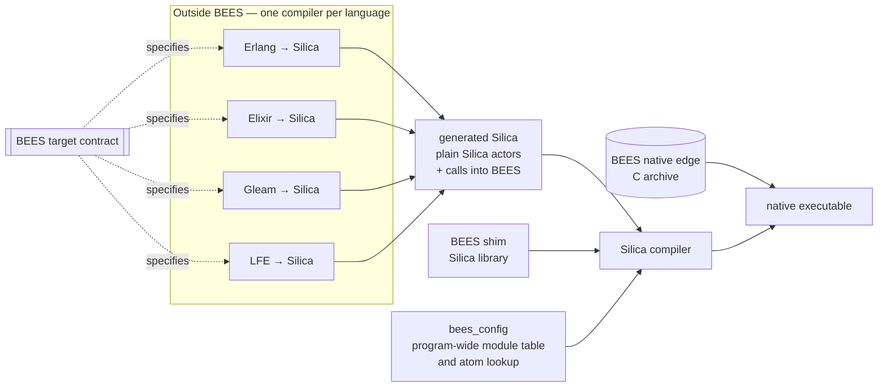

# BEES Roadmap — Proof of Concept to Complete Library

This document is the master plan for Project BEES, from proof of concept to a complete library. It also records, for
each gap between what Silica provides and what compiled BEAM-language code needs, who closes that gap.

It builds on [parallel-tracks.md](parallel-tracks.md), which remains authoritative on **how the work is organized**.
Companion documents:

- [gap-ledger.md](gap-ledger.md) — how each BEAM construct maps onto Silica, what Silica provides today, and who owns
  each gap.
- [inter-nodal-modes.md](inter-nodal-modes.md) — the two distribution modes: **SEMP/TRUST** (the default) and
  **standard BEAM distribution** (an explicit downgrade, and the mode for OTP interop).

All statements about Silica below were checked against the Silica repository at Apple Silicon **fixed point 1**
(commit `8aff9cdc5`, 2026-09-13; 33,824 trials green). Where the Silica specification and the implementation
disagree, this plan follows the implementation and the trials, and names the spec section it is waiting on.

---

## 1. Purpose

**BEES is the shim that lets BEAM languages be compiled to Silica and its constructs.** It is not an attempt to
reproduce the BEAM's code API for Silica programmers.

**Possible, not easy** (D19). BEES does not duplicate every BEAM type or behaviour. Its purpose is to make it
*possible* to compile a BEAM language to Silica, not to make it easy.
- Where Silica can already express a behaviour, however awkwardly, reproducing it is the language compiler's job.
- BEES and Silica change only where something would otherwise be impossible.
- How faithful a compiled program is to its behaviour on the BEAM is each compiler's business, not a BEES guarantee.

The BEAM has two parts, and each is replaced differently:

- **The emulator** (the bytecode interpreter) is replaced by **compilation**. Each BEAM language gets its own
  language-to-Silica compiler (Erlang, Elixir, Gleam, LFE). **Those compilers are outside the scope of BEES.** They
  are separate projects, and all of them target one BEES **target contract**.
- **The runtime system (ERTS)** is replaced by **Silica constructs wherever they exist** and by the **BEES shim
  wherever they do not.**
  - Silica supplies:
    - processes (actors) and **per-core scheduling**: carrier threads, run queues, fairness, preemption and priority;
    - **atoms and the atom table**;
    - supervision, gen_server-style behaviours and state machines;
    - links and registries;
    - crash containment.
  - The BEES shim supplies the BEAM-specific parts of ERTS:
    - **balancing and placement across cores** (D3);
    - the term model;
    - BIFs, ETS and timers;
    - ports;
    - distribution, including SEMP/TRUST.



The **target contract** is the specification that lets independent compilers interoperate in one program. For
example, Elixir code calls Erlang's `lists` module, and both are compiled by different compilers. The contract fixes:

1. **Term representation.** The `bees_term` layout as Silica types. An atom is a Silica atom: compilers emit every
   atom as a Silica atom literal, so it is interned in Silica's atom table, and list it in the module's manifest for
   the atom lookup (§4.6). A binary is a `buf(uint8)` plus a bit length, never a Silica `string`. How a compiler reads
   and builds those bytes is its own choice (§4.5); the contract fixes only the representation.
   - A local pid is an `actor_ref`. Its identity, used for equality, ordering and printing, is the actor's
     **64-bit identity** (D22): the position of the spawner that numbered it, which in BEES is always its
     supervisor, and the child number that spawner gave it, printed as `<position.child_number>`.
   - A remote pid adds the node.
2. **Process model.** A BEAM process is a **plain Silica actor** whose messages are `bees_term` values. Code that does
   not fit Silica's once-per-message behaviour (a `receive` in the middle of a function, for example) is **reshaped by
   the compiler** (D1). The compiler keeps the paused computation in the actor's state and uses BEES's runtime
   helpers: the save queue for selective receive, the `after` timers, and memory evacuation.
   - **Every actor has a supervisor** (D18). The program knows all its supervisors and actors, and the compiler keeps
     a key-value collection (a Silica `wbt_map`) from each supervisor position to its supervisor. A pid carries its
     supervisor's position (D22), so the lookup never needs updating when an actor dies.
   - `exit(Pid, Reason)` becomes a request to Pid's supervisor, which shuts Pid down and reports it.
   - Every supervisor reports each child's exit to a **report sink** (D23): BEES's exit hub on that core.
   - Failure messages are Silica's own. For example, an exit carries Silica's atom `failure_reason`, not an Erlang
     term.
   - BEES provides neither `trap_exit` nor monitors (D20). How `link` is lowered is each compiler's choice.
3. **Calling convention.** How arguments are passed (including how more than 8 of them are packed), how results and
   exceptions are returned, and how BIFs are named and called. Runtime failures are not returned at all: they fail the
   actor (D2).
4. **Dynamic calls.** Each compiled module provides dispatch entries for `apply/3` and for its funs, together with a
   manifest. `bees_config` combines the manifests into a program-wide module table. BEES itself relies on that table
   (for TRUST, remote spawn, and `spawn/3`).
5. **OTP behaviours.** How `supervisor`, `gen_server` and `gen_statem` callback modules are expressed with Silica's
   `Supervisor` trait, gen_server-style behaviours and state-machine trait.
   - A Silica behaviour is either call-only or cast-only (spec §16.2.6.1). So a `gen_server` module that handles both
     calls and casts becomes **two Silica gen_server-style actors**, one call-only and one cast-only (D5).
   - The contract fixes which of the two holds the state and where `handle_info` messages go.
   - It also fixes how a client's cast followed by a call to the same server stays in order when the two travel
     through different mailboxes.
6. **Memory and yielding.** Where compilers place **evacuation points** and **yield points**, and which BEES API
   calls go at each (§4.2, §4.3). Both kinds of point sit at receive boundaries and tail calls, where the reshaped code
   holds every live value explicitly.
   - Silica never interrupts a message dispatch (spec §15.1.2).
   - So at a yield point, a process whose dispatch budget is spent **ends its dispatch**, exactly as it would at a
     `receive`, and continues through `cast(self())`. The budget is a BEES helper that counts the work done in the
     current dispatch.
   - Silica's per-core scheduler then runs the other actors on that core.
   - Dispatch boundaries are also where a `migrate_actor()` request takes effect (§4.10).
7. **Naming.** A reserved module-name prefix for each language, plus BEES's own `bees_` prefix.
8. **Versioning.** The contract has its own version, and BEES reports which contract versions it supports.

No `.beam` file is loaded at run time and no bytecode is interpreted. Running Erlang/OTP systems are reached on the
wire, through standard BEAM distribution mode.

## 2. The ownership rule

BEES contains **only the portions of the BEAM that Silica lacks.** Every gap belongs to exactly one class:

| Class | Meaning | Owner | Examples |
| --- | --- | --- | --- |
| **U — Upstream** | Missing in Silica, but Silica is where it belongs. Either Silica's spec promises it and the runtime or compiler does not deliver it yet, or it belongs alongside what Silica already provides. A library cannot supply it. | The Silica repository. BEES tracks it as a prerequisite (Track S) and may contribute the work there. | **gen_server and state machines** (beside the `Supervisor` trait); links (a stub today); the **per-core scheduler** the spec describes (carrier threads running many actors, with fairness, preemption and priority; today every actor is its own pthread); one program-wide atom table; Silica's own TCP/IP; byte buffers across the FFI boundary; bignums; region release. |
| **B — BEES shim** | BEAM-specific runtime semantics with no place in Silica. | BEES, permanently. | **Balancing and placement across cores** (D3); the `bees_term` model and Erlang term order; BIFs; ETS; timers; the receive helpers; the process dictionary helpers; ETF; TRUST; BEAM distribution; `bees_config`. |
| **C — Compiler** | Supplied by how a language compiler translates code. | **Each language's compiler, outside BEES.** BEES specifies the obligation in the target contract. | Pattern matching; reshaping code around `receive`; `try`/`catch` lowering; defunctionalized funs; per-module dispatch entries; placing evacuation points; bit syntax and integer bitwise operators, through lookups each compiler generates; compiling each language's standard library, and OTP's Erlang libraries. |
| **E — Native edge** | Needs OS, board or cryptographic facilities Silica has no primitive for. Everything it returns reaches BEES only through re-creation (S-5). One audited C archive behind `dangerous_bees_*` wrappers, reached through Silica's Fifi and built for each target: against the OS on hosted targets, and against the board on the raw targets (S-24). Every function has a named retirement trigger. | BEES, temporarily. | TCP sockets and kqueue/epoll (until Silica's own TCP/IP, S-22), TLS 1.3 engine, SHA-512, MD5, CSPRNG, monotonic clock. |

Consequences:

- **A BEAM process is a plain Silica actor** (D1, decided). BEES does not wrap actors, ship a second actor runtime, or
  keep a process-object layer. A local pid *is* an `actor_ref`.
- **Silica schedules each core; BEES balances and places across cores** (D3, decided).
  - Silica's runtime owns per-core scheduling: carrier threads, run queues, fairness, preemption and priority (spec
    §15.1.2, Actor Pinning Policy, and §23.1.1).
  - The runtime never moves an actor between cores. BEES does that, BEAM-style, entirely through `migrate_actor()` and
    the core id given at spawn. Its jobs are:
    - initial placement, through the placement hook;
    - load balancing across cores;
    - keeping blocking and `dangerous` actors on cores reserved for them, because a worker blocked in C holds its
      carrier.
  - What a pin guarantees depends on who owns the cores (§4.10). **OS-hosted**, an actor's binding to its core's
    carrier thread is hard, but the OS may still move that thread. **Running raw**, a pin is exclusive.
- **OTP behaviours are Silica traits** (D5, decided). `gen_server`, `gen_statem` and `supervisor` callback modules are
  compiled to Silica's gen_server, state-machine and `Supervisor` traits, not to OTP's Erlang implementations of
  those behaviours.
- **OTP's Erlang libraries are compiled code, not BEES code.** Examples are `lists`, `gen_tcp`, `logger`, `erpc`,
  `global` and `pg`. The Erlang-to-Silica compiler compiles them. BEES provides the ERTS layer underneath them: BIFs,
  `prim_inet`, `prim_file`, and the distribution BIFs.
- **BEES is written in Silica, and the native edge is kept small.** "Don't roll your own crypto," and Silica's own TLS
  design note says to wrap a vetted engine (`tls_quantum_safe_future.md` §2–3).

## 3. Work streams and external dependencies

[parallel-tracks.md](parallel-tracks.md) defines Tracks A and B. This plan adds two more streams and names one
external dependency.

- **Track A — On-node shim** (BEES repo). Terms and memory; the runtime helpers for processes and signals on plain
  Silica actors; BIFs and ERTS-level modules; the mapping of OTP behaviours onto Silica traits; host I/O;
  observability; **balancing and placement** across cores.
- **Track B — Inter-nodal** (BEES repo). Node identity, the two distribution modes, and the wire codecs.
- **Track T — Target contract** (BEES repo). The contract specification and a **conformance kit**. The kit contains
  reference lowerings: hand-written Silica showing exactly what a compiler should emit for each construct. It also
  contains a test suite a compiler can run to check itself against BEES. Track T is also how BEES tests itself before
  any compiler exists.
- **Track S — Silica prerequisites** (Silica repo). The class-U items in the
  [gap ledger](gap-ledger.md#3-track-s--silica-prerequisites). BEES files each one as the smallest reasonable proposal,
  with a reproducing trial, and may implement it. That work follows Silica's own rules: fixed points, trial goldens,
  and `AI_POLICY.md` (human-vetted, no AI co-authors, smallest reasonable PRs).
- **External dependency: the language compilers.** They are not BEES work. BEES publishes the contract early (Stage
  0), keeps it stable, and uses the first available compiler (expected to be Erlang's) as its integration partner
  (I3).

Schedule risk lives in Track S and in the external compilers. Every milestone below lists what it blocks on.

## 4. Engineering constraints

These come from the FP1 toolchain as it actually is, not from the spec. Each one is a design rule for BEES, and for
the contract, until the named item removes it.

1. **Compiled BEAM code is dynamically typed, so every value is a `bees_term`.** BEES is largely monomorphic over one
   type, which makes Silica's lack of generics mostly irrelevant here. The contract specifies how compilers pack more
   than 8 arguments, because 8 is Silica's parameter limit.
2. **Memory must be reclaimed without a garbage collector.** Erlang code allocates constantly. Silica has regions and
   no GC, and today a per-actor arena is never reclaimed while the actor lives (a bump allocator with 8 MB
   committed).
   - *Rule:* a process's terms live in a region held in its actor state. At **evacuation points** the live terms are
     copied into a fresh region and the old region is released.
   - The contract places evacuation points at receive boundaries and tail calls. At those points every root is
     explicit in the reshaped code (D1): the paused computation, the save queue and the dictionary, or the arguments
     of the tail call.
   - This is copying collection at points where the compiler knows every root, so no stack scanning is needed. It
     **requires region release (S-15), which makes S-15 a 1.0 blocker.**
3. **One OS thread per actor, 512 KB stack, 1 GiB virtual reservation per actor.**
   - *Rule:* the PoC targets thousands of processes, not millions, and spike S3 measures the real ceiling.
   - This retires when Silica's runtime delivers the per-core scheduler its spec describes, with each carrier thread
     running many actors (S-6).
   - Because of D1, a process holds no stack between messages. A scheduling step is therefore one message dispatch,
     or one dispatch-budget slice ended at a yield point, and an actor's stack is needed only while that step runs.
   - Deep body recursion in Erlang (`lists:map` over long lists) still needs growable stacks during a step: roadmap
     chunk 1, part of S-6.
4. **Erlang integers are arbitrary precision.** *Rule:* the PoC is limited to `int64`, and overflow raises
   `system_limit`. Conformance needs Silica bignums (S-11).
5. **Binaries and bit syntax are lowered without type conversion.** Silica has no type conversion (types must match
   exactly, with no widening: spec §8.2.3), and BEES adds none. Silica's bitwise operators take only `uint64`
   (§7.3.1), and `substring` counts UTF-8 characters.
   - *Rule:* a binary is a `buf(uint8)` plus a bit length, never a Silica `string`.
   - Bit syntax is the **language compiler's** responsibility (class C). Literal binaries, strings and floats become
     bytes at compile time, in whatever language the compiler is written in. For run-time values, the compiler
     generates its own **lookups**, for example a 256-entry `case` from a byte to the `int64`, `uint64` or `float64`
     literal of the same value, and combines them with same-type arithmetic. Each language decides how best to do this.
   - The same holds for Erlang's integer bitwise operators: Erlang integers are `int64`, and Silica's bitwise operators
     take `uint64`, so compilers cross between the two byte by byte through their lookups.
   - BEES's own byte handling (ETF, TRUST framing, EPMD and the handshake, UTF-8 validation in `bees_ingress`) is
     hand-written Silica using the same technique. The ETF decoder is therefore Silica from the start, not native code.
   - Bytes enter and leave as `buf(uint8)`. Network bytes come from **Silica's own TCP/IP implementation** (S-22).
     Anything that still passes through the native edge, such as TLS records until S-13 and file data, needs
     `buf(uint8)` across the FFI boundary (S-21); until then the edge packs bytes into records of `uint64` words.
6. **Atoms belong to Silica, and Silica's atom table is fixed at compile time.** The spec interns every atom into one
   global atom table (§4.1.7). There is no dynamic atom table: nothing adds an atom at run time. In the
   implementation, atoms are numbered per compilation unit.
   - *Rule:* a BEAM atom **is** a Silica atom. **BEES has no atom table of its own.** Compilers emit every atom as a
     Silica atom literal, so a program's atoms are exactly the atoms in its compiled code.
   - **Silica has no type conversion, and BEES adds none.** `atom_to_list/1`, `list_to_existing_atom/1`, printing and
     ETF are therefore **lookups**, not conversions. Each compiler lists the atoms its code uses in the module's
     manifest, and `bees_config` generates a program-wide **atom lookup** from the manifests, beside the module table.
     The lookup pairs each atom literal with its spelling as a string literal; for example, `atom_to_list` is a `case`
     over atom literals. It neither interns nor creates atoms: they remain Silica's.
   - No atom is created at run time. `list_to_atom/1` and `binary_to_atom/2` can only return an atom the lookup already
     holds (D16), and atoms arriving on the wire are accepted only if the lookup holds them
     ([inter-nodal-modes §1.2](inter-nodal-modes.md#12-re-creation-and-the-ingress-gate)).
   - Spike S2 must show that atoms survive `use` boundaries. If they don't, that is S-1, and it blocks everything.
7. **FFI taint and the `dangerous_` cascade.** BEES keeps Silica's FFI spec as written.
   - Data returned from a `dangerous_*` module stays tainted however it is copied or transformed (FFI spec §7.4).
   - It may not appear in `network_io` or `device_io` sequences (§7.3).
   - A receiver must consume or discard it inside the handler for the FFI result cast (§7.6).

   The resulting rules:
   - *Rule:* FFI-derived data reaches BEES only through **re-creation** (S-5). Re-creation is a compiler-implemented
     trait: it validates a tainted value against its declared type and limits, builds a new, pure value in a fresh
     region, and rejects anything that does not fit.
     - Until S-5 lands, nothing the native edge returns can leave the handler that receives it. That handler may still
       *use* such a value to decide what to do, for example accepting or rejecting a token comparison.
   - Re-creation checks structure. **`bees_ingress`** then does the protocol validation, on everything that arrives from
     the network: TLS plaintext that has been re-created, and bytes from Silica's own sockets, which are untainted but
     still untrusted.
     - It checks frame bounds, depth and count limits, UTF-8, atoms against the atom lookup, and schemas.
     - On any failure it drops the input silently toward the peer and writes an audit entry.
     - It is a security boundary, fuzzed as one, with no other path in.
   - **TLS and secure random bytes come through the native edge at first** (D17), and may become Silica built-ins
     later. Until they do, every app that uses TRUST, BEAM mode (whose handshake needs random challenges) or
     `crypto:strong_rand_bytes` has a root module named `dangerous_*`.
8. **There is no package mechanism.** *Rule:* every BEES module basename starts with `bees_` (or `dangerous_bees_`).
   `bees_config` assembles the consumer's `silica.config` from BEES and the compilers' output, and generates the
   program-wide module table and atom lookup. It retires with S-7.
9. **There is no CI.** Silica's "CI" is a human-run `make integrate` of about an hour on Apple Silicon. *Rule:* BEES
   keeps its own trial tree in Silica's format, pins the compiler generation it was verified with, and re-runs the
   tree on every compiler bump.
10. **Placement depends on who owns the cores.** Silica's Actor Pinning Policy (spec §15.1.2) pins every actor from
    spawn until it terminates.
    - The runtime never moves an actor on its own.
    - A `migrate_actor()` request takes effect at the actor's next dispatch boundary or yield point, and message order
      is preserved.

    What a pin guarantees differs by environment:
    - **Raw chip cores** (OS-free targets: **ESP32-S3** and **AArch64**). No OS shares the core, so a pin is
      **exclusive and hard**.
    - **OS-hosted.** The actor is bound to the runtime's carrier thread for its core, and the runtime never moves it to
      another carrier on its own. The OS still owns the cores: it may run other threads on the same core or move the
      carrier thread, and on some hosts (Apple Silicon macOS) affinity is only a hint. Exclusive placement is never
      guaranteed.
    - *Rule:* BEES does balancing and placement in both environments, BEAM-style, entirely through `migrate_actor()`
      and the core id given at spawn.
      - **Running raw**, it balances directly onto the cores (S-23).
      - **OS-hosted**, it balances between the runtime's carrier threads, the way the BEAM migrates processes between
        its scheduler threads.
      - It never moves a process the program placed explicitly.
      - Because of D1, a process holds no stack at a dispatch boundary, so a migration carries only its actor state
        and mailbox.
    - BEES documents what a pin means in each environment, and never promises exclusivity on an OS-hosted target.

---

## 5. Milestones

Stages 0 and 1 are shared. After that, Tracks A, B and T run **in parallel**, with Track S alongside all of them.
They meet at three integration points (I1–I3), then converge in two cross-cutting milestones (X1, X2). Every
milestone closes with **trials**, not with code that merely compiles.

```mermaid
graph LR
  M0[Stage 0<br/>Ground truth] --> M1[Stage 1<br/>PoC]
  M1 --> A1[A1 Terms & memory] --> A2[A2 Processes & signals] --> A3[A3 ERTS modules & BIFs] --> A4[A4 OTP behaviours<br/>on Silica constructs] --> A5[A5 Host I/O &<br/>observability]
  A2 --> A6[A6 Balancing &<br/>placement]
  M1 --> T1[T1 Contract 1.0] --> T2[T2 Conformance kit]
  M1 --> B1[B1 TRUST 1.0] --> B2[B2 TRUST multiplexing]
  M1 --> B3[B3 BEAM mode L1–L2] --> B4[B4 BEAM mode L3–L4]
  A2 --> I1{{I1 Remote lifecycle}}
  B3 --> I1
  A5 --> I2{{I2 Network I/O}}
  B1 --> I2
  T2 --> I3{{I3 First external<br/>compiler}}
  EXT([external: Erlang → Silica<br/>compiler]) -.-> I3
  I1 --> X1[X1 Cluster semantics]
  I2 --> X1
  I3 --> X1
  A6 --> X2[X2 Scale]
  A4 --> X2
  X1 --> R1[Release 1.0]
  X2 --> R1
  B2 --> R1
  B3 --> R1
  B4 -.after 1.0.-> P
  R1 --> P[Post-1.0]
```

### Stage 0 — Ground truth

**Goal:** turn the unknowns in §4 into measured facts, set up the repository, and publish contract v0 so that
compiler projects can start.

- **R0.1 Repository and build.**
  - Source layout: `src/shim/`, `src/inter_nodal/`, `src/contracts/`, `contract/` (the specification and the
    conformance kit), `native/`, `trials/`, `tools/`.
  - A trial harness mirroring Silica's `trials/silica_compiler.mk` (the exit-75 reclaim loop, `.scout` and
    `.golden_fail` goldens).
  - `bees_config`.
- **R0.2 Feasibility spikes.** Each produces a short findings note under `development-plan/spikes/` and at least one
  trial.

  | Spike | Question | Kills or reshapes |
  | --- | --- | --- |
  | **S1 Trait mapping** | Can generated code implement Silica's `Supervisor` trait with `bees_term` state and messages, specialized at compile time, across the >32-unit reclaim path? Does a `gen_server` module split into a call-only and a cast-only Silica actor keep OTP semantics (shared state, `handle_info`, cast-then-call order)? What must Silica's state-machine trait look like to host `gen_statem` modules? | Contract item 5; the shape of S-17. |
  | **S2 Cross-unit atoms** | Does a Silica atom minted in one unit compare equal in another, as a message, a state field and a case pattern? Does a generated atom lookup, a `case` over atom literals from several units, return the right spelling for each? | Everything. Failure means filing S-1 as a blocker. |
  | **S3 Actor ceiling** | Maximum live actors, and RSS/VA per actor, on 16 GB and 64 GB Macs; the cost of a spawn and of one message. | PoC scale; the urgency of S-6. |
  | **S4 Native edge** | A `dangerous_bees_native` wrapper (`clock_gettime`, `poll`) called from a `spawn_dangerous` worker. What do the naming cascade and the W4001 warning look like in a consumer app? | Every E-class component. |
  | **S5 Bytes without conversion** | Hand-lower bit-syntax matching and construction, a 64-bit float decode and encode, and `bxor` on `int64`, using only lookups and same-type arithmetic. How are `uint8` literals written and matched in a `case`? Does a 256-way `case` compile to a jump table or to a chain of comparisons? What does each lowering cost? | BEES's own codecs (ETF, framing); the guidance BEES gives compiler projects. |
  | **S6 Terms and heap** | `bees_term` as a recursive tagged tuple (`recursive_tuple_specification.md`) in a region held in actor state. Can a region be released today? What does an evacuation cost? | Contract items 1 and 6; the urgency of S-15. |
  | **S7 Exit reports** | Prototype D23 in a Silica branch: a supervisor that casts an `exit_report` record (`{ child, child_id, failure_reason, restarted, new_child }`) to the report sink set with `:set_report_sink` after handling each child exit, with child supervisors inheriting the sink. Measure the cost per exit, and check that reports arrive in ingress order. | S-28; the exit hub in A2. |
  | **S8 Re-creation** | Hand-write what a compiler-derived re-creation would generate for BEES's FFI flows: random bytes, digests, TLS peer information, TLS plaintext and ciphertext. Check the declared limits first, build in a fresh region, rebuild enumerations from literals, and return `:rejected` on any failure. Pin with a `.golden_fail` trial that today's checker rejects the direct path. | The shape of S-5; every path from the native edge. |
  | **S9 Reference lowerings** | Hand-lower four small Erlang programs into Silica exactly as the draft contract says a compiler should: a selective receive with `after` in mid-function (reshaped per D1), `try`/`catch` with stack traces, funs with `apply/3`, and binary matching. | Contract items 2–4; the first programs in the conformance kit. |
  | **S10 Failure paths** | Check that a BIF failure inside a compiled process ends the actor with an explicit reason atom, for example `(:explicit, :badarg)`. Check that the supervisor's report (D23) carries that reason, and see what Silica's crash report shows. | D2; the shape of S-9's explicit abnormal stop. |
  | **S11 Balancing through `migrate_actor()`** | On today's runtime, what does `migrate_actor()` cost? Does it take effect at the next dispatch boundary, and does message order hold across a move? Can BEES balance well using only the work counts it keeps itself, with no load data from the runtime? | A6; whether BEES needs scheduler statistics from Silica. |
  | **S12 TLS engine (D6)** | Specified in [spikes/S12-tls-engine.md](spikes/S12-tls-engine.md); not yet run. Wrap rustls behind a small C interface that owns no sockets. Then check, on each target: it builds; TLS 1.3 with both sides presenting certificates works; X25519MLKEM768 is negotiated and classical-only peers are refused; the ALPN is `trust/1`; the peer's certificate DER and its SHA-512 are available; code size and RAM on the ESP32-S3. The raw targets need rustls without `std`, a crypto provider written in pure Rust, and the esp-rs toolchain for the ESP32-S3. | D6; the native edge's TLS entries; B1. |

- **R0.3 Contract v0.** Published as `contract/target-contract.md`, covering the eight items in §1, with the S9
  lowerings as worked examples. It starts from the construct mapping in [gap-ledger §1](gap-ledger.md). The
  maintainers of the language compiler projects are invited to review it.
- **R0.4 Track S filed.** Each S-item becomes a short Silica issue, with a failing trial where one can be written.

**Exit criteria:** all twelve spike notes are merged; D2 is recorded; contract v0 is published and has been
reviewed by at least one compiler project.

### Stage 1 — Proof of concept: "lowered Erlang on two nodes"

**Goal:** a thin vertical slice through the shim, the contract and both distribution modes. Scale and completeness
are out of scope. The PoC runs the **reference lowerings**: Silica written by hand exactly as contract v0 says a
compiler would emit. If an external Erlang-to-Silica compiler exists by then, the PoC runs its output too.

- **Track A slice: shim v0.**
  - `bees_term` for `int64`, atoms (Silica atoms), tuples, lists, pids (local `actor_ref`s), and binaries as opaque
    values;
  - region evacuation at receive boundaries;
  - the receive helpers (save queue, `after` timer);
  - `bees_timer` over a native clock;
  - the BIFs the PoC programs use: `self/0`, `spawn/3` through the module table, `element/2`, `length/1`, send, and
    an `io:format/2` subset;
  - a `supervisor` callback module as a Silica `Supervisor` trait implementation.
- **Track T slice:** contract v0 exercised end to end by the reference lowerings, and `bees_config` generating the
  program-wide module table and atom lookup.
- **Track B slice.** Real network traffic needs re-creation (S-5): TLS and secure random bytes come through the
  native edge (D17), and nothing the edge returns can leave its handler until S-5 lands. The slice is built in two
  steps.
  - **Protocol layers over an in-process loopback transport.** Two BEES nodes in one OS process exchange frames
    through actors. A clearly marked, deterministic, test-only source stands in for random bytes and TLS.
    - **TRUST:** lowered Erlang on node A calls `trpc:call(Host, Port, {M,F,A}, Args)`, the BEAM_SEMP API. Node B runs
      the allowlisted function through the module table, in a per-request worker. The call exercises the whitelist,
      the token path, suspicion, and framing.
    - **BEAM mode:** the EPMD exchange, the handshake, and message delivery run between two BEES nodes.
  - **On real sockets, once S-5 lands.** TRUST over TLS 1.3 mTLS between two BEES nodes. A lowered Erlang process
    exchanges messages with a process on a real `erl -sname` node, in cleartext and loudly logged as a downgrade.

**Exit criteria:**

- Three Erlang programs produce the same output on BEES, as reference lowerings, as they do on the BEAM: a ping-pong
  with selective receive, a process ring, and a supervised worker restarted after a crash.
- Latency and per-process memory are measured.
- The TRUST and BEAM-mode protocol layers pass their trials over the loopback transport. If S-5 has not landed, the
  real-socket step moves into B1 and B3.
- No FFI-derived value reaches a process except through re-creation.
- The gap ledger is updated.

### Track A — On-node shim

| ID | Milestone | Contents | Blocks on | Exit criteria |
| --- | --- | --- | --- | --- |
| **A1** | Terms and memory | All `bees_term` types, with atoms as Silica atoms; Erlang term order and both equalities; the atom BIFs (`atom_to_list`, `list_to_existing_atom`, and `list_to_atom` per D16) as lookups in the atom lookup; maps in term order over `wbt_map`; binaries as `buf(uint8)` terms, and the binary BIFs; bignums; `term_to_binary`/`binary_to_term` (with `safe`) in Silica; the evacuation API. | S-1, S-11, S-15 | Worked programs, as reference lowerings, that exercise every term type, term comparison and bit syntax. A long-running process's memory stays flat under load. |
| **A2** | Processes and signals | Runtime helpers for plain Silica actors:<br>• the save queue and `after` timers for reshaped `receive`;<br>• the process dictionary helpers;<br>• `exit/2` as a request to the target's supervisor, found through the compiler's actor-to-supervisor map (D18);<br>• **the per-core exit hub** (D23), which receives every supervisor's exit reports and does BEES's fixed bookkeeping: removing a dead pid's names, deleting tables it owned, ending its BEES-level link partners, and telling node connections about remote links (Silica's registry removes names once S-29 lands);<br>• **a supervisor for every actor**: BEES supervisors, sharded per core, to which a plain `spawn` adds a `temporary` child;<br>• the `spawn`, `spawn_link` and `spawn_opt` BIFs over Silica spawn;<br>• registered-name BIFs over Silica's atom-keyed registry (S-29);<br>• timers (`send_after`, `start_timer`, `cancel_timer`, `read_timer`);<br>• `process_info`, `processes/0`, `is_process_alive/1`. | S-2, S-26, S-28; S-9 and S-29 (soft); S-3 (the native clock stands in) | Worked programs, as reference lowerings: a selective receive with `after`, a supervised process shut down by `exit/2`, a linked pair, and a registered name that disappears when its process exits. |
| **A3** | ERTS modules and BIFs | The `erlang` module's BIFs, in coverage tiers. **Result-returning versions of commonly caught BIFs** (D2), for example existing-atom conversions, number parsing, and `binary_to_term`, plus a call variant that returns `timeout` as a value. `ets` (actor-owned tables over `wbt_map`, with documented concurrency differences). `persistent_term`, `atomics`, `counters`, `os`, `init` and the boot sequence, `code` over the program-wide module table. Handler back ends for compiled `logger`. `crypto` (hash, HMAC, `strong_rand_bytes`) over the native edge. | A1, A2; S-8 | Each BIF tier passes its trial subset. |
| **A4** | OTP behaviours on Silica constructs | The contract's mapping of `supervisor` onto Silica's `Supervisor` trait, `gen_server` onto a call-only and a cast-only Silica gen_server-style actor (D5), and `gen_statem` onto Silica's state-machine trait, with reference lowerings. `proc_lib` and `sys` runtime support. Each documented difference from OTP (`hibernate`, `code_change`, `sys` debug) goes in the README. | S-17, S-2 | Worked programs, as reference lowerings: a supervision tree, a split `gen_server`, and a `gen_statem`. Every difference from OTP is listed in the README. |
| **A5** | Host I/O and observability | `bees_io`: one event loop per core, over Silica's own TCP/IP implementation (S-22), and over kqueue/epoll in the native edge until it lands. `prim_inet` under compiled `gen_tcp`/`gen_udp`/`inet`, with `{active, once}` backpressure. `prim_file` under compiled `file`. Group leaders and the I/O protocol server. Telemetry. | S-8; S-22 soft (native-edge sockets stand in) | A lowered TCP echo server holds 1,000 concurrent connections; a slow reader pauses its socket. |
| **A6** | Balancing and placement | BEES balancing and placement across cores, in both environments (§4.10), entirely through `migrate_actor()` and the core id given at spawn:<br>• initial placement (the placement hook);<br>• BEAM-style load balancing, moving processes from busy cores to idle ones as the BEAM's work stealing does;<br>• cores reserved for blocking and `spawn_dangerous` actors, including every native-edge worker;<br>• the per-core spawn supervisors that plain `spawn` goes through (D18), each replaced by one at a fresh position before it runs out of child numbers (D22);<br>• the dispatch-budget helper that compiled code checks at its yield points (contract item 6);<br>• overload protection, and a watchdog that detects and reports runaway dispatches (Silica does not interrupt a dispatch);<br>• load statistics BEES keeps itself, for `erlang:statistics/1` and `erlang:system_info/1`. | A2; S-6 (Silica's per-core scheduler, for scale); S-23 (raw) | Using only `migrate_actor()`, a skewed spawn is evened out, OS-hosted and on ESP32-S3 and AArch64. Every migration takes effect at a dispatch boundary with message order intact. No explicitly placed process is ever moved. A CPU-bound compiled loop ends its dispatch at yield points, so its neighbours on the same core keep running. |

### Track T — Target contract

| ID | Milestone | Contents | Blocks on | Exit criteria |
| --- | --- | --- | --- | --- |
| **T1** | Contract 1.0 | All eight contract items specified completely. That includes cross-language rules: every language's atoms are Silica atoms, and there is one module table, one atom lookup and one exception representation for every language, so that Elixir-compiled code can call Erlang-compiled code. It also includes a versioning and deprecation policy. | A1, A2, A4 | Every construct in gap-ledger §1 whose class is C has a contract section and a reference lowering. |
| **T2** | Conformance kit | The reference lowerings, plus a self-check suite that a compiler runs against BEES. The suite consists of source programs, expected output and contract assertions. It is packaged so that compiler projects can run it in their own CI. | T1 | The kit runs green on BEES's own reference lowerings. |

### Track B — Inter-nodal

Details are in [inter-nodal-modes.md](inter-nodal-modes.md).

| ID | Milestone | Contents | Blocks on | Exit criteria |
| --- | --- | --- | --- | --- |
| **B1** | TRUST 1.0 (single request) | The `trust/1` wire spec, including its own term encoding (D8). `trpc:call/cast`, the BEAM_SEMP API. Server-side execution of allowlisted MFAs through the module table in a per-request worker. Whitelist, forbidden guard, suspicion and quarantine (D10), tokens, timeouts and limits, fail-fast config, audit log. Client side: A/AAAA resolution, stagger, per-server token cache, mutual pinning. | A2; S-17 soft (until Silica's state-machine trait lands, the connection FSM is a plain behaviour with a phase field); native TLS edge; S-5 (re-creation) | A negative-path suite: every failure mode in the SEMP README closes the connection with no error body, writes a log entry, and changes suspicion. The frame fuzzer runs 24 hours with no crash. |
| **B2** | TRUST windowed multiplexing | Everything in the multiplexing design doc: session windows, GOAWAY, `max_inflight` with read-pause backpressure, a worker per request under a per-connection supervisor, cancel-by-close, metrics. Limits set to 1 must reproduce B1 exactly. | B1, A5 | That doc's acceptance criteria 1–10 as trials; p95 latency improves on B1. |
| **B3** | BEAM mode L1–L2 | EPMD (client, and an optional server). The version 6 handshake, which refuses any peer whose node name is not in the program's atom lookup (D16). ETF on the wire. Remote pids; sending to pids and registered names; links and exit signals across nodes (node connections learn of local deaths from the exit hub, D23); losing a node; net ticks. The distribution BIFs (`node/0`, `nodes/0`). Monitor requests from OTP peers are dropped (D21). | A2, S-2; S-5 (random challenges); S-22 (sockets) | L1 and L2 work, in both directions, against the OTP release named in D14. |
| **B4** | BEAM mode L3–L4 (after 1.0) | SPAWN_REQUEST through the module table, subject to the scoped `spawn` option. A TLS distribution variant compatible with `inet_tls_dist`. The ERTS hooks that compiled `net_kernel`, `global` and `pg` need. | B3 | Remote spawn works in both directions against Erlang nodes; the TLS variant interoperates. With compiled OTP `erpc`/`global`/`pg`, the tests move into I3. |

### Integration points and cross-cutting milestones

| ID | What meets | Exit criteria |
| --- | --- | --- |
| **I1** Remote lifecycle | A2 exits × B3 control messages | When a remote process exits, or its node is lost, the exit reaches the local processes linked to it, through their supervisors (D18). |
| **I2** Network I/O | A5 `bees_io` × B1 transport | TRUST and BEAM-mode sockets are ports on the A5 event loop. |
| **I3** First external compiler | T2 kit × the first language-to-Silica compiler (expected: Erlang) | The compiler passes the conformance kit, and it compiles and runs demonstration programs of its own choosing on BEES. How faithful that compiler is to the BEAM is its own business; BEES publishes no fidelity rate. Anything the compiler finds impossible becomes a ledger row. |
| **X1** Cluster semantics | Membership, partitions, cluster observability | A three-node cluster mixing BEES and OTP nodes survives a partition and heals, with documented link behaviour. |
| **X2** Scale | BEES balancing (A6) on Silica's per-core scheduler and growable stacks (S-6) | Published benchmarks against the BEAM on the same hardware: spawn rate, message latency, fairness under load, 1 million idle processes. |

### Release 1.0 — definition of done

BEES 1.0 is done when compiling a BEAM language to Silica is **possible** (D19): every BEAM construct has a route to
Silica, and that route is demonstrated. It does not mean BEAM programs behave identically.

1. **Contract.** Contract 1.0 is published, versioned and documented, and the conformance kit is available to
   compiler projects.
2. **A route for every construct.** Every row of the gap ledger is one of these:
   - closed with trials;
   - assigned to the compilers (class C), with a **reference lowering** in the conformance kit that compiles and runs
     on BEES;
   - listed in the ledger's "Not provided" section.

   The reference lowerings are the proof that compilation is possible.
3. **Compiler integration.** At least one external compiler has passed I3.
4. **Silica constructs.**
   - BEAM processes are plain Silica actors, and every actor has a supervisor.
   - Silica schedules actors on each core, and BEES balances them across cores.
   - Supervision, gen_server-style behaviours and state machines are Silica's.
   - BEES duplicates none of them.
5. **Distribution.** TRUST (B1, B2) passes its conformance, negative-path and fuzz suites. BEAM mode reaches L1 and L2
   (B3) against the OTP release named in D14. L3 and L4 (B4) follow after 1.0.
6. **Security review.** An external review has covered TRUST, `bees_ingress`, every re-creation point and the native
   edge, and its findings are closed.
7. **Native edge.** It is minimal and audited, and every entry has a retirement trigger.
8. **Platforms.** The BEES trial tree passes on both Silica hosted AArch64 paths, and on the two raw targets, ESP32-S3
   and AArch64.
   - Raw AArch64 needs Silica's bare-metal AArch64 path, which does not exist yet (S-27).
   - To begin with, the raw targets reach the native edge's facilities (TLS, random bytes, hashes, the clock) through
     Fifi, like the hosted targets, with the edge built against each board instead of an OS. That needs Fifi on the
     raw targets (S-24).
   - Every edge entry keeps its retirement trigger. Sockets retire to Silica's own TCP/IP (S-22).
9. **Documentation.** It states what BEES provides, what it deliberately does not provide (the ledger's
   "Not provided" section), and what each compiler must do (the contract).

### Post-1.0

- **BEAM mode L3 and L4** (B4): remote spawn, TLS distribution, and the hooks compiled `global` and `pg` need.
- **Hot code upgrade**, on Silica dynamic linking and `hot_swap` (S-12). The contract gains a module-versioning
  section.
- **TEMPUS**, built as a layer on top of TRUST (D12): Cyclon membership, Ed25519 identity, producer-signed tokens, proof of possession.
- **`trust/2`**: remote links over TRUST, reconsidered after X1 (D9).
- **Ports** to more Silica emitters.
- **Native-edge retirement:** TLS moves to Silica TLS intrinsics (S-13), constant-time comparison to `CtMask` (S-14).

---

## 6. Decisions

Every decision has a status: **Decided** (with the date), **Withdrawn**, **Open — under discussion**, or **Open**. For an open
decision, the third column holds a *proposal* to start the discussion from; it is not a recommendation that anything
depends on yet.

| ID | Decision | Status and outcome, or proposal | Notes |
| --- | --- | --- | --- |
| **D1** | Process execution model. | **Decided 2026-09-14:** processes are plain Silica actors, and the compiler reshapes whatever does not fit Silica's once-per-message behaviour. BEES provides runtime helpers (save queue, `after` timers, evacuation) and does not wrap actors. | Needs no language change, because Silica forbids user `recv()` (§15.1.2). Every root is explicit at evacuation and yield points (§4.2). A process holds no stack between messages, so a scheduling step is one dispatch. |
| **D2** | Runtime failures and exceptions. | **Decided 2026-09-15: nothing is caught inside the actor.**<br>• A failing BIF, a `badmatch`, `badarith`, `function_clause` or `case_clause`, and **`throw`** all **fail the actor**, and its supervisor reports the exit (D23).<br>• BIFs never return failures as values to compiled code. The actor stops with an explicit reason atom, for example `(:explicit, :badarg)` (S-9).<br>• **Compilers reject `catch` clauses, `after` clauses and Erlang's `catch Expr` at compile time**, with a diagnostic. An `after` block could never run when the body fails, because the failure ends the actor.<br>• **BEES offers result-returning versions of commonly caught BIFs**, for example `{ok, Atom} \| error` for `list_to_existing_atom`. A compiler may rewrite a `try` that catches exactly that BIF's failure into a call to the variant; otherwise the program calls the variant directly.<br>• **A call variant that returns `timeout` as a value**, rather than failing the caller when the callee doesn't reply in time. It covers the common OTP pattern of catching `exit:{timeout, _}` around `gen_server:call`.<br>• Stack traces come from Silica's crash report, through `FailureReporter`. | Silica aims to catch failures at compile time, so catching failures at run time goes against the language. The supervisor is the one place where failures are handled. The contract's calling convention therefore needs no exception representation. |
| **D3** | Who schedules, balances and places processes. | **Decided 2026-09-15, revising 2026-09-14:** Silica's runtime owns per-core scheduling (carrier threads, run queues, fairness, preemption, priority), as its Actor Pinning Policy (§15.1.2) and §23.1.1 specify. **BEES owns balancing and placement across cores**, BEAM-style, through `migrate_actor()` (A6, §4.10). No scheduler interface is needed. | The 2026-09-14 outcome was "the scheduler lives in BEES", which the current Silica spec contradicts: it gives each core's scheduling to the runtime, and offers no hook for a library. |
| **D4** | Language compilers. | **Decided 2026-09-14: out of scope.** Each language has its own language-to-Silica compiler, and BEES owns the target contract they share. | — |
| **D5** | OTP behaviours. | **Decided 2026-09-14:** gen_server and state machines are Silica constructs beside the `Supervisor` trait (S-17). **Decided 2026-09-15:** an Erlang `gen_server` that handles both calls and casts becomes **two Silica gen_server-style actors**, one call-only and one cast-only, because a Silica behaviour must be one or the other (spec §16.2.6.1). S-19 is withdrawn. | Contract item 5 must fix which of the two actors holds the state, where `handle_info` messages go, and how a client's cast followed by a call stays in order across the two mailboxes. |
| **D6** | TLS engine for the native edge. | **Decided 2026-09-15: rustls everywhere**, on the hosted targets and on the raw targets (ESP32-S3, bare-metal AArch64), behind one C interface in the native edge. The interface owns no sockets: ciphertext in, ciphertext and plaintext out, no callbacks into Silica. Confirmed by spike S12, with Mbed TLS on the raw targets as the fallback if the spike fails there. | rustls is memory-safe and TLS 1.3 only, supports hybrid X25519MLKEM768 and mTLS with a custom verifier, and exposes the peer certificate DER. The Rust toolchain is needed only to build the native edge. |
| **D7** | How the two modes coexist on one node. | **Decided 2026-09-15:** TRUST is on by default. BEAM mode is off by default and runs as a separate listener, enabled explicitly, with a downgrade banner. Both may run at once. | Based on parallel-tracks.md, "Opting down to BEAM-equivalent security." |
| **D8** | TRUST payload encoding. | **Decided 2026-09-15: a TRUST-specific format, not ETF.** `trust/1` frames carry their own compact term encoding, defined in B1. It covers integers, floats, binaries, atoms by spelling (existing atoms only, D16), lists, tuples and maps. It has no pids, references, ports or funs. The codec is written in Silica, as part of `bees_trust`. | There will be no Erlang clients, so ETF's one advantage, being readable by Erlang SEMP nodes, does not apply. A format made for TRUST is simpler to parse and to validate in `bees_ingress`. ETF stays for BEAM mode only. |
| **D9** | Should TRUST gain remote links (`trust/2`)? | **Decided 2026-09-15: not for 1.0.** Remote links over TRUST (`trust/2`) are reconsidered after X1. | TRUST's model is short, permissioned sessions. |
| **D10** | Quarantine recovery. | **Decided 2026-09-15: an operator reset only.** A peer's suspicion score decays on successful calls while it stays below the limit. Once quarantined, a peer stays out until an operator resets it through a local-only administration function. | The SEMP README contradicts itself on this point. |
| **D11** | Whitelist key. | **Decided 2026-09-15: SHA-512 of the certificate's full DER**, with a documented rotation procedure. | The SEMP README describes the key two different ways. |
| **D12** | TEMPUS in 1.0? | **Decided 2026-09-15: after 1.0, as a layer on top of TRUST.** TRUST is built first (B1, B2). TEMPUS then reuses TRUST's transport, framing, encoding and ingress path, and adds membership and admission for ephemeral nodes. | — |
| **D13** | NIFs. | **Decided 2026-09-15: the compilers' job, not BEES's.** A language-to-Silica compiler reworks each NIF into a **Silica actor wrapping the external call**, as standard Silica does: a `dangerous_*` module with a `wrapper_meta` sidecar, called from a `spawn_dangerous` worker. BEES provides no `erlang:load_nif`. | What follows for compilers:<br>• A NIF call is synchronous in Erlang, but a Silica FFI worker answers with a cast, so the compiler reshapes the call site into a request plus a wait for the result (D1).<br>• A result used beyond the handler that receives it (stored in state, or sent on) needs re-creation (S-5).<br>• Every app using a NIF has a root module named `dangerous_*`.<br>• If the foreign call faults, the worker dies. The compiler must make the calling process fail too (D2), for example by linking the two with a Silica link.<br>• On the raw targets this needs Fifi there (S-24). |
| **D14** | Which OTP release's semantics the shim's BIFs follow. | **Decided 2026-09-15: the newest OTP release when Stage 0 begins**, named in the roadmap at that point. BEAM-mode interop for 1.0 is tested against that one release. | BIF semantics drift between OTP releases. BEAM-mode interop for 1.0 is tested against this one release. |
| **D15** | How the BEES scheduler drives plain Silica actors. | **Withdrawn 2026-09-15.** Under the revised D3, BEES does not drive actors; it moves them with `migrate_actor()`. | — |
| **D16** | What happens to a spelling that is not in Silica's atom table. | **Decided 2026-09-15: existing atoms only, everywhere.** `list_to_atom/1` and `binary_to_atom/2` behave as `list_to_existing_atom/1` and `binary_to_existing_atom/2`: a lookup that raises `badarg` when it finds no atom. `bees_ingress` rejects any frame carrying an atom the program does not hold, in both modes. In BEAM mode, **every node allowed to connect must be named in the code**. A peer whose node name is not in the atom lookup is refused at the handshake with the protocol's `not_allowed` status. | Chosen for security: the set of BEAM-mode peers is fixed when the program is built, and no peer can make the program hold a new atom. Consequences: adding a BEAM-mode peer means rebuilding the program, and cluster membership that changes at run time (for example nodes with generated names) is not supported in BEAM mode. The BEES node's own name must also be in the code. Rejected: *foreign atoms*, which would carry an unknown spelling as a term value. |
| **D17** | TLS and secure random bytes. | **Decided 2026-09-15:** they come through the native edge (Fifi) at first, and may become Silica built-ins later. | Consequences: TRUST, BEAM mode's handshake challenges and `crypto:strong_rand_bytes` all depend on re-creation (S-5). Every app that uses them has a root module named `dangerous_*` until the built-ins arrive. |
| **D18** | Exits and supervision. | **Decided 2026-09-15:**<br>• BEES requires every actor to have a supervisor.<br>• `exit(Pid, Reason)` is lowered by the language compiler into a request to Pid's supervisor, which shuts Pid down and reports it.<br>• The compiler finds that supervisor through a key-value collection it builds from a Silica collection (the program knows all its supervisors and actors).<br>• Failure messages do not have to match the BEAM's.<br>• `trap_exit` is not provided; how `link` is lowered is each compiler's choice. | This resolves contradiction 4 without changing Silica's supervisor-only trapping or its atom-only `failure_reason`. What still needs Silica: S-26 (the 64-bit actor identity, D22) and S-9 (stopping and shutdown). Because a restarted child gets a new identity, an exit request aimed at an old pid never reaches its replacement. Where a supervisor's report goes is D23. |
| **D19** | What BEES is for. | **Decided 2026-09-15: possible, not easy.** BEES does not duplicate every BEAM type or behaviour. It makes compiling a BEAM language to Silica possible. Reproducing BEAM behaviour that Silica can express is the compiler's job, and fidelity to the BEAM is not a BEES guarantee (§1). | This reshaped the definition of done: 1.0 is reached when every construct has a demonstrated route, not a published fidelity rate. |
| **D20** | Monitors. | **Decided 2026-09-15: monitors are not part of BEES.** BEES neither provides `erlang:monitor/2`, `spawn_monitor` or `monitor_node` to compiled code nor uses Silica monitors itself. | The main BEAM uses of monitors are covered another way or left to compilers. A pending Silica `call` already wakes with the callee's death result, and supervisors handle fate-sharing. Cleaning up after a client that dies, and waiting for work to finish, are for compilers to build from what Silica and BEES provide. S-25 is withdrawn and S-2 narrows to links. |
| **D21** | What BEAM mode does with monitor requests from OTP peers. | **Decided 2026-09-15: reject them, by dropping them silently.** This applies to standard BEAM distribution mode only; TRUST has no remote pids, links or monitors, so it never receives them. BEES ignores `MONITOR_P` and `DEMONITOR_P` from Erlang nodes and never sends `MONITOR_P_EXIT`. | The distribution protocol has no "refused" reply; its only answer is `MONITOR_P_EXIT`, which means the target is dead. `gen_server:call` monitors its target first, so answering that way would make every call from an OTP node to a BEES process fail with `noproc`. With the requests dropped, calls still get their replies. A caller whose BEES target dies mid-call waits out its timeout. If the BEES node disconnects, OTP's own connection handling still fires the caller's monitor with `noconnection`. |
| **D22** | Actor identity. | **Decided 2026-09-15, and aligned with Silica spec §15.1.4 the same day.** An actor's identity is a **fixed 64-bit value**: a 32-bit **position**, naming the spawner that numbered the actor, and a 32-bit **child number**, the number that spawner gave it. A pid therefore maps directly onto the BEAM wire's 32-bit id and 32-bit serial.<br>• **Positions belong to spawners.** A spawner is a supervisor, any other actor that spawns, or `main` (not an actor), which is position 0. The root supervisors that `main` starts take the next positions, and a root supervisor is reached by its registered name as well as by its identity. Silica's compiler numbers every spawner's position at build time, in tree order.<br>• **In BEES the spawner is always the supervisor.** Every actor has a supervisor (D18) and every spawn goes through one, so a BEES process's position is its supervisor's position. That is what the compiler's actor-to-supervisor map is keyed by.<br>• **No shared counter.** Each spawner numbers only its own children, from 0 upward, and never reuses a number, so a restarted child has a new identity. A spawner's position is stable across its restarts, and its numbering continues: its supervisor keeps the high-water mark in the child-table row and hands it back on restart.<br>• **Positions for spawners started at run time.** A spawner that starts spawners at run time owns a block of positions, sized by the compiler; a spawner started at run time gets a slice of its parent's block. BEES's per-core spawn supervisors move to a fresh position before they run out of child numbers (S-26).<br>• **Exhaustion.** A spawner that runs out of child numbers or positions fails with `(:explicit, :identity_exhausted)`, which a supervisor treats as a breach of its restart intensity.<br>• **Equality and order** compare the pair (position, child number). Silica's `actor_id` returns the value, printed as `<position.child_number>`. A remote pid is the node plus the identity.<br>• **A stale ref never equals a live actor.** That is enough; detecting stale refs is not required.<br>• **Named actors compare by pid, as in Erlang.** A name is a lookup, not an identity. A restarted named actor is reachable by the same name, but its new pid does not compare equal to the old one. | This belongs in Silica (S-26), because Silica's runtime assigns the numbers. Rejected: a program-wide counter (shared state that every spawn touches), generational slots, and random 128-bit identities. Today an `actor_ref` is a pointer to a control block that is freed when the actor dies, so the address can be reused. **The alignment with Silica's text changed three things:** positions were generalised from supervisors to every spawner (`main` is position 0); Silica's compiler numbers positions, not `bees_config`; and order compares (position, child number), not the path through the tree. |
| **D23** | Where a supervisor's exit reports go. | **Decided 2026-09-15, and aligned with Silica spec §15.4.10.5 the same day.** A supervisor is given a **report sink** with the `call_supervisor` op `{ op: :set_report_sink, sink }`, and its child supervisors inherit the sink. After a supervisor handles a child's exit, whether or not it restarts the child, the runtime casts a report to the sink: `exit_report ::= { child, child_id, failure_reason, restarted: boolean, new_child }`.<br>• Reports are sent in supervision-ingress order.<br>• The supervisor never waits on the sink.<br>• A report is dropped when there is no sink or the sink has ended.<br>BEES points each supervisor at **BEES's exit hub** on the supervisor's core. It sets the sink when it starts a supervisor, and inheritance covers any supervisor it does not set. The hub does fixed bookkeeping only: deleting tables the dead process owned, ending its BEES-level link partners, and telling node connections about remote links. It also removes the process's names until Silica's registry does that itself (S-29). | With every actor supervised (D18) and no monitors (D20), supervisor reports are the only reliable news of a death. The sink is a purpose-built actor whose message type is the report type, so the typing problem behind the withdrawn S-25 does not return. The hub offers no subscription API, so it gives compiled code nothing that works like a monitor. Needs Silica: S-28. Rejected: querying supervisors only when needed (links and remote links would have to poll), and actors reporting their own deaths (which misses abrupt deaths). **The alignment with Silica's text changed two things:** the sink is set with an op and inherited, not named in the supervisor's flags; and the report is a record, not a tuple. |

## 7. Top risks

| Risk | Effect | Mitigation |
| --- | --- | --- |
| No external compiler is ready when the shim is. | I3 and 1.0 slip, and the shim is validated only by hand-written lowerings. | Publish contract v0 at Stage 0; the conformance kit makes a compiler's first steps cheap; the reference lowerings keep BEES testable on its own. |
| The contract underspecifies something two compilers then do differently. | Code compiled by different compilers cannot interoperate. | Cross-language rules in T1; the conformance kit includes cross-language programs; the contract is versioned. |
| Region evacuation is too slow, or S-15 is late. | Long-lived processes cannot run. | Spike S6 first; push S-15 early; tune evacuation thresholds in A1. |
| Track S items slip or are declined (especially S-1, S-2, S-6, S-11, S-15, and S-24 for the raw targets). | Stage 1, A1, A2, A6 and conformance stall. | File them early with failing trials, and offer to implement them. For S-6, spike S11 produces a working prototype of the interface to propose. |
| Byte handling through lookups is too slow (a 256-way `case` per byte; float encode and decode). | Binary-heavy code and ETF run slowly. | Spike S5 measures before A1; each compiler chooses its own lowering; BEES tunes its own codecs. |
| Balancing only through `migrate_actor()` is too coarse: the runtime gives no load data, and a move takes effect only at a dispatch boundary. | A6 cannot even out load well enough. | Spike S11 measures before A6 starts. BEES keeps its own per-process work counts, and asks Silica for scheduler statistics if they prove necessary. |
| A defect in `bees_ingress`. | Remote input reaches processes unvalidated. | One gate, no bypass, kept small, fuzzed per validator, inside the external review. |
| Re-creation (S-5) is late, or narrower than BEES's FFI flows need. | No real network traffic: Track B stays on the loopback transport. | Spike S8 gives Silica concrete shapes to implement. The protocol layers keep moving over the loopback transport, so only the last step waits. |
| Silent miscompilation in the Silica compiler, amplified by the volume of generated code. | Wrong answers even with green trials. | Differential testing against a reference BEAM; minimize any reproducer to a Silica trial immediately; pin compiler generations. |
| OTP semantics drift. | BIFs diverge from newer OTP releases. | D14 pins one release; the interop matrix is re-run for each new OTP release. |
