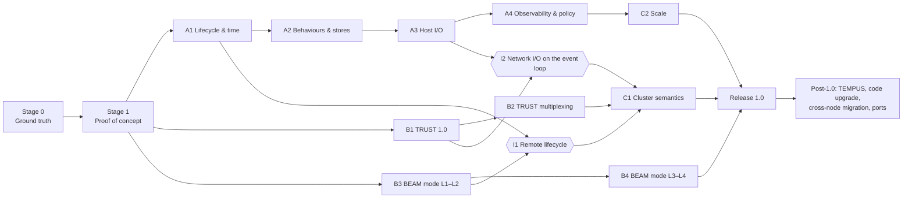

# BEES Roadmap — Proof of Concept to Complete Library

This document is the master plan for Project BEES. It takes BEES from a proof of concept to a complete library
that can stand where a BEAM would, and it records who closes each gap between "what Silica provides" and "what a
BEAM-idiom program needs."

It builds on [parallel-tracks.md](parallel-tracks.md), which remains authoritative on **how the work is organized**
(Track A on-node, Track B inter-nodal, developed in parallel). Companion documents:

- [gap-ledger.md](gap-ledger.md) — every BEAM capability, its status in Silica today, who owns closing it, and when.
- [inter-nodal-modes.md](inter-nodal-modes.md) — the two distribution modes: **SEMP/TRUST** (default) and
  **standard BEAM distribution** (explicit downgrade / OTP interop).

All statements about Silica below were checked against the Silica repository at Apple Silicon **fixed point 1**
(commit `8aff9cdc5`, 2026-09-13; 33,824 trials green). Where the Silica specification and the implementation
disagree, this plan follows the implementation and the trials, and names the spec section it is waiting on.

---

## 1. What "replace the BEAM with a library" means

BEES is **not** a bytecode VM. It does not load `.beam` files or run Erlang/Elixir source. It is a set of Silica
modules an application includes so that a program written in the **BEAM idiom** — processes as actors, links and
monitors, supervision, timers, registered names, OTP-style behaviours, distribution — runs natively on Silica, with
no VM underneath.

Interoperability with real Erlang/OTP systems happens **on the wire**, through standard BEAM distribution mode, not
by executing Erlang code.

## 2. The ownership rule

BEES contains **only the portions of the BEAM that Silica lacks**. Reading the Silica spec against the Silica runtime
shows three different kinds of "lack", and each has a different owner:

| Class | Meaning | Owner | Example |
| --- | --- | --- | --- |
| **U — Upstream** | Silica's spec promises it, but the runtime or compiler does not deliver it yet. A library *cannot* supply it, because it lives in compiler-emitted runtime code. | Silica repository; BEES tracks it as a prerequisite (Track S below) and may contribute the work there. | `link`/`monitor`/`demonitor` are typed but are no-op stubs in `prims_actors_runtime_asm.silica`; spec §15.1.2.2 promises actors that are "not OS threads" but `spawn` is `pthread_create`. |
| **B — BEES-owned** | Neither implemented nor specified in Silica, and belongs above the language. | BEES, permanently. | Timers, trap-exit, gen_statem, distribution, TRUST, ETF, node identity. |
| **E — Native edge** | Needs OS or cryptographic facilities Silica has no primitive for. Lives in one audited C archive behind `dangerous_bees_*` wrappers, each function with a named retirement trigger. | BEES, temporarily. Each item retires when its Silica replacement lands. | TCP sockets, kqueue/epoll, TLS 1.3 engine, SHA-512, CSPRNG, monotonic clock. |

Two consequences follow:

- **BEES does not ship a second actor runtime.** A BEES process is a Silica actor. Supervisors, the `Supervisor`
  trait, `call`/`cast`, registries and crash containment are Silica's; BEES builds on them. The multi-core scheduler
  the BEAM is famous for is a **Silica runtime** deliverable (class U), with BEES writing the requirements and owning
  the *policy* layered above it (placement, balancing, overload). Decision gate **D1** (§6) covers the fallback if
  Silica declines that work.
- **BEES code is written in Silica; the native edge is kept deliberately small.** "Don't roll your own crypto" and the
  Silica TLS design note (`design_documents/tls_quantum_safe_future.md` §2–3: "wrap an engine") both require a vetted
  TLS engine. Everything that *can* be Silica is Silica.

## 3. Three work streams

[parallel-tracks.md](parallel-tracks.md) defines Tracks A and B. This plan adds a third stream it depends on but
does not own:

- **Track A — On-node** (BEES repo). Process surface, lifecycle, time, behaviours, local stores, I/O, observability,
  scheduling *policy*.
- **Track B — Inter-nodal** (BEES repo). Node identity, the two distribution modes, wire codecs, cluster semantics.
- **Track S — Silica prerequisites** (Silica repo). The class-U items in the [gap ledger](gap-ledger.md#3-track-s--silica-prerequisites).
  BEES files them as the smallest reasonable proposals, supplies reproducing trials, and may implement them, under
  the Silica project's own rules (fixed points, trial goldens, and `AI_POLICY.md`: human-vetted, no AI co-authors,
  smallest reasonable PRs).

Track S is where BEES's schedule risk lives. Every milestone below lists the S-items it blocks on, so a slip upstream
is visible immediately rather than discovered late.

## 4. Engineering constraints that shape every milestone

These come from the FP1 toolchain as it is, not the spec. Each one is a design rule for BEES code until the named
Silica item removes it.

1. **Per-actor arena memory is never reclaimed while the actor lives** (bump allocator, 8 MB committed, freed at
   death). *Rule:* long-lived BEES actors (listeners, connection owners, registries) must be allocation-light; per-
   request work runs in **short-lived worker actors**. The TRUST multiplexing design already has this shape (one
   temporary worker per request). Retires with region release, Silica roadmap chunk 4.
2. **One OS thread per actor, 512 KB stack, 1 GiB virtual reservation per actor.** *Rule:* the PoC targets thousands
   of processes, not millions, and spike S3 measures the real ceiling. Retires with S-6 (carrier scheduler) and
   roadmap chunk 1 (growable stacks).
3. **Recursion is the only loop, and stacks don't grow yet.** *Rule:* codecs and list walks are written tail-
   recursively with bounded depth; nesting depth is a checked protocol limit, which is also a security property.
4. **No generics; polymorphism is traits plus compile-time specialization. No named types (E1047). Max 8 parameters.**
   *Rule:* BEES behaviours follow the `Supervisor` pattern (`impl MyServer for BeesServer;` plus callbacks); shared
   shapes are passed as records; the library prefers a few wide envelope records to many narrow ones, to hold down
   compile RAM.
5. **No package mechanism.** Consumers splice source paths into their `silica.config`; `wrapper_meta` paths are rooted
   at the consuming project. *Rule:* every BEES module basename starts with `bees_` (or `dangerous_bees_`) so it is
   globally unique, and BEES ships its own `bees_config` tool. Retires with S-7.
6. **Strings are the only byte container crossing FFI, and Silica code has no byte access to them** (no `byte_at`;
   `substring` counts UTF-8 characters; `buf(uint8)` is rejected at the FFI boundary with E2112; no `bxor`, no bit-
   casts, no width conversions). *Rule:* binary *decoding* (frames, ETF, X.509) happens in the native edge and
   crosses into Silica as flat records or token streams; binary *encoding* can be pure Silica. Retires with S-4.
7. **FFI taint and the `dangerous_` cascade.** Any app that uses BEES networking must name its root module
   `dangerous_*`. FFI-derived data may not be sent to an ordinary actor *directly*, but it **may be copied, and the
   copy sent**. *Rule:* every byte that enters through the native edge reaches ordinary actors only through the
   **BEES copy gate** (`bees_ingress`), a B-class component that performs the copy and builds the safeguards into it.
   This is the same copy / validate / re-encode discipline the brokered-IPC design gives its broker, done in-process.
   - Enforce hard size caps before copying.
   - Bound structure depth and element counts.
   - Validate UTF-8 wherever text is expected.
   - Keep remote atoms as strings; never intern them.
   - Validate each endpoint's schema.
   - Construct fresh Silica values; no FFI-owned bytes survive into the copy.
   - On any failure, drop the input, write an audit log entry, and apply suspicion, with nothing sent back to the
     peer.

   The gate is a security boundary. It is fuzzed like one, and there is no other path in.
8. **Atoms are compile-time only, and are numbered per compilation unit in the implementation** (contradicting spec
   §4.1.7's global table). *Rule:* remote atoms are **strings** in BEES (which also makes atom-table exhaustion
   attacks impossible by construction), and spike S2 must establish whether atoms survive `use` boundaries between BEES
   and application modules. If they don't, that is S-1 and blocks everything.
9. **No CI.** Silica's "CI" is a human-run `make integrate` (about 1 hour) on Apple Silicon. *Rule:* BEES keeps its
   own trial tree in Silica's format (`.silica` + `.scout` / `.golden_fail`), pins the compiler binary it was
   verified with, and re-runs the tree on every compiler bump.

---

## 5. Milestones

Stages 0 and 1 are shared. After the proof of concept, Track A and Track B proceed **in parallel** (per
parallel-tracks.md). They meet at two integration points (I1, I2) and then converge in two cross-cutting milestones
(C1, C2). Track S runs continuously alongside both.

Every milestone closes with **trials**, not with code that merely compiles. That is the same rule Silica applies to
its own chunks.

### Stage 0 — Ground truth

**Goal:** turn the unknowns in §4 into measured facts, set up the repository, and write the four integration
contracts as Silica types.

Work packages:

- **R0.1 Repository and build.**
  - Source layout: `src/on_node/`, `src/inter_nodal/`, `src/contracts/`, `native/` (the C edge), `trials/`, `tools/`.
  - `tools/bees_config.sh` generates a consumer's `silica.config` with BEES sources spliced in, and copies the native
    edge's `wrapper_meta` sidecars and `libdangerous_bees_native.a` into the consumer's
    `dangerous_exposure_source/`.
  - A trial harness mirroring Silica's `trials/silica_compiler.mk` (exit-75 reclaim loop, `.scout` and
    `.golden_fail` goldens). The harness records the pinned compiler's generation number and hash.
  - Reuse of prebuilt `.iface`/`.o` files (the `ordered_data_structures/leaf.mk` technique), so that BEES is not
    recompiled for every application.
- **R0.2 Feasibility spikes.** Each spike produces a short findings note under `development-plan/spikes/` and at least
  one trial:

  | Spike | Question | Kills or reshapes |
  | --- | --- | --- |
  | **S1 Behaviour traits** | Can a *library-defined* trait be implemented by a user module the way `impl X for Supervisor;` works, with trait-typed state and messages specialized at compile time, and does that survive the >32-unit reclaim path? | The whole OTP-behaviour design (A2). |
  | **S2 Cross-unit atoms** | Does `:timeout` minted in a BEES module compare equal to `:timeout` in an app module, as a message, as a state field, and as a case pattern? | Everything. Failure means filing S-1 as a blocker. |
  | **S3 Actor ceiling** | Maximum live actors, and RSS/VA per actor, on a 16 GB and a 64 GB Mac. Time to spawn and to deliver one message. | PoC scale targets; urgency of S-6. |
  | **S4 Native edge** | A `dangerous_bees_native` wrapper (`clock_gettime`, `poll`), called from a `spawn_dangerous` worker. What does the naming cascade and the W4001 warning look like in a two-module consumer app? | Shape of every E-class component. |
  | **S5 Bytes** | Best representation for frames: `string` produced by the native edge plus records of decoded fields. Prototype a u32 length prefix encoded in pure Silica. | Codec split (native vs Silica). |
  | **S6 Term model** | `bees_term` as a recursive tagged tuple (`recursive_tuple_specification.md`, `ref?(R, normal, rec)` child/sibling links) versus a flat token list. Measure arena use per decoded term. | Every codec and the remote envelope. |
  | **S7 Death observation** | Can BEES observe the death of an actor it does not supervise (via a `FailureReporter`, a pending `call`, or anything else) *without* runtime `monitor`? Expected answer: no, which confirms S-2 as a hard prerequisite. | Whether A1 can start before S-2. |
  | **S8 Copy gate** | A dangerous worker receives FFI bytes; `bees_ingress` copies and validates them into fresh values and casts those to an ordinary actor. Confirm the taint checker accepts the gated path, and pin the rejection of *direct* forwarding with a `.golden_fail` trial. | The ingress path for every E-class component and every remote message. |

- **R0.3 Integration contracts v0** (the four contracts named in parallel-tracks.md, written as Silica types in
  `src/contracts/`):
  - **Identity** `bees_pid`: `{node: string, local: actor_ref, serial: uint64, creation: uint64}`. `node` is empty
    for local processes. `serial` and `creation` exist so that a restarted actor or a restarted node is never
    confused with its predecessor.
  - **Envelope** `bees_envelope`: `{from: bees_pid, to: bees_pid, kind: atom, corr: uint64, body: bees_term}`. It is
    used by every generic or remote-facing component. Application logic behind an endpoint remains statically typed:
    the endpoint decodes `body` into its own message type at the boundary, which doubles as schema validation.
  - **Lifecycle events**: `(:down, monitor_ref, actor_ref, failure_reason)` exactly as spec §15.4.8.6 defines it, plus
    the BEES `exit` notification for processes that trap exits.
  - **Placement hook**: `fn place(request: bees_placement_request) -> bees_placement`. Track A answers "which core",
    Track B answers "which node".
- **R0.4 Track S ledger filed**: each S-item in the gap ledger becomes a short issue in the Silica repo, with a
  failing trial attached where one can be written.

**Exit criteria:** all eight spike notes merged; decisions D1–D4 (§6) recorded; contracts v0 compile in a trial;
`bees_config` builds a two-module consumer app against the pinned compiler.

### Stage 1 — Proof of concept: "two nodes, one supervised call"

**Goal:** a thin vertical slice through both tracks and both distribution modes, proving the architecture end to end.
Scale and polish are explicitly out of scope.

- **Track A slice**
  - `bees_node` boot: read the configuration with `read_lines`, fail fast on invalid values, start the node's root
    supervisor.
  - `bees_pid` issuance.
  - `bees_timer`: `send_after` and `cancel_timer` on a `brodal_okasaki` deadline heap, driven by a native-edge clock
    and a bounded `poll` tick.
  - `bees_server`: a gen_server-style behaviour trait (if S1 passes), with call timeouts implemented through
    `bees_timer`.
  - Structured logging to stderr.
- **Track B slice, TRUST**
  - One request per connection (connect → token → call → close) between two BEES nodes on localhost.
  - TLS 1.3 mTLS through the native edge.
  - SHA-512 fingerprint whitelist loaded from the host app's configuration.
  - Explicit `hello` / `token_present` first frame. The reference implementation's 2-second silence timeout is not
    ported; see inter-nodal-modes.md §3.6.
  - Endpoint registry, suspicion counter, and no error bodies on the wire.
- **Track B slice, BEAM mode**
  - The BEES node registers with EPMD and completes the distribution handshake with a real `erl -sname` node, using a
    cookie, in cleartext and loudly logged as a downgrade.
  - The Erlang node sends `{bees_echo, Node} ! {self(), hello}` and receives the reply.

**Exit criteria:**

- a scripted demo and its trials;
- the handshake and request latencies measured;
- every native-edge value reaches an ordinary actor only through `bees_ingress` (§4 item 7), and a `.golden_fail`
  trial shows that direct forwarding is rejected;
- the gap ledger updated with anything the PoC discovered.

### Track A milestones — On-node

| ID | Milestone | Contents | Blocks on | Exit criteria |
| --- | --- | --- | --- | --- |
| **A1** | Lifecycle and time | Links, monitors and exit signals adopted from Silica once S-2 lands, with BEES adding: **trap-exit** (exits delivered as messages to opted-in processes), `bees_exit/2` producing `(:explicit, atom)`, `is_alive`. Time: monotonic and system time, `send_after`/`start_timer`/`cancel_timer`/`read_timer`, sleep, behaviour-level receive timeouts (`timeout` returned from a callback, as in gen_server). Registry extensions: string names, auto-unregister on death, `via`-style name resolution hooks. | S-1, S-2, S-3 (the native clock stands in for S-3) | Trials for each link/monitor/trap-exit rule in spec §15.4.8 plus the BEAM behaviours BEES adds; timer accuracy measured. |
| **A2** | Behaviours and stores | `bees_server` (gen_server), `bees_statem` (gen_statem, including state timeouts; this is what the TRUST connection FSM is built on), `bees_event` (gen_event), `bees_task`, `bees_app` (application: start order, environment, config validation, stop). `bees_table`: ETS-like tables owned by an actor over `wbt_map` (`set`, `ordered_set`, `bag`, with explicit statements of what cannot match ETS, such as concurrent reads), and boot-time constant terms (`persistent_term` analogue). | S1 findings; S-9 (explicit stop) | Each behaviour has a trial suite ported from the corresponding OTP documented contract; TRUST's FSM runs on `bees_statem`. |
| **A3** | Host I/O | `bees_io`: one event-loop actor per core over kqueue (macOS) or epoll (Linux), in the native edge. Ports as actors, with BEAM `{active, once}` semantics for backpressure. File I/O beyond Silica's `read_lines`/`append_file`. Sockets (TCP/UDP) as ports. | S-4 for the pure-Silica parts | A TCP echo server with 1,000 concurrent connections; backpressure trial showing a slow consumer pausing reads. |
| **A4** | Observability and scheduling policy | Logger (levels, handlers, structured fields, rate limiting, redaction), telemetry events, process introspection (`process_info` analogue: pids, registered names, message counts where the runtime exposes them), crash reports wired to Silica's `FailureReporter`, tracing hooks. Policy: placement hook implementations, affinity and balancing through `migrate_actor`/`pin_actor_to_core`, overload protection, a watchdog for runaway handlers. | S-8 (mailbox introspection) | An operator can list a node's processes and follow one request end to end through logs and telemetry. |

### Track B milestones — Inter-nodal

Details are in [inter-nodal-modes.md](inter-nodal-modes.md).

| ID | Milestone | Contents | Blocks on | Exit criteria |
| --- | --- | --- | --- | --- |
| **B1** | TRUST 1.0 (single request) | The full `trust/1` wire spec: frames, the hello and token paths, calls and casts. Whitelist, endpoint permissions, forbidden endpoint namespaces. Suspicion and quarantine with the reset policy decided (D6). All timeouts and size limits from the SEMP README, validated at boot with fail-fast. Audit log. Client side: A/AAAA resolution, multi-address attempts with stagger, token cache pinned per server fingerprint, **mutual whitelisting** (the client pins servers too). | A2 (`bees_statem`), native TLS edge | Conformance suite including a negative-path suite (every failure mode listed in the SEMP README yields a close with no error body, plus a log entry and a suspicion change); frame fuzzer runs for 24 hours without a crash. |
| **B2** | TRUST windowed multiplexing | Everything in the multiplexing design doc: session windows (age, count, idle), GOAWAY with reasons, `max_inflight` with read-pause backpressure, a temporary worker per request under a per-connection supervisor, cancel-by-close, the metrics and telemetry events listed there. Limits set to 1 must reproduce TRUST 1.0 exactly. | B1, A4 | Acceptance criteria 1–10 from the multiplexing design doc as trials; p95 latency improves on the single-request baseline. |
| **B3** | BEAM mode L1–L2 | EPMD client (and an optional EPMD server). Distribution handshake v6 (cookie challenge). ETF codec. Remote pids, SEND and REG_SEND in both directions. LINK, UNLINK_ID, MONITOR_P, DEMONITOR_P and exit propagation across nodes. Net ticks and nodedown. | A1, S-2 | Interoperability matrix against OTP 26, 27 and 28: messaging, links, monitors and nodedown trials all pass. |
| **B4** | BEAM mode L3–L4 | SPAWN_REQUEST limited to **exported spawnable endpoints** (so `erpc`/`rpc` from Erlang works against an allowlist; there is no general `apply`). A TLS distribution variant compatible with `inet_tls_dist`. Optional `global`/`pg` compatibility. Scoped downgrade flags. | B3 | Erlang's `erpc:call(BeesNode, M, F, A)` succeeds for exported endpoints and is refused for everything else; the TLS-dist variant interoperates. |

### Integration points and cross-cutting milestones

| ID | What meets | Exit criteria |
| --- | --- | --- |
| **I1** Remote lifecycle | A1 lifecycle events × B3 link/monitor control messages. | A local monitor on a remote pid fires with `noconnection` when the peer node dies, and with the peer's reason when the remote process dies. |
| **I2** Network I/O on the event loop | A3 `bees_io` × B1 TRUST transport. | TRUST and BEAM-mode sockets are ports on the A3 event loop; no distribution component owns a dedicated polling thread. |
| **C1** Cluster semantics | Node identity and membership, a location-transparent `bees_send`/`bees_call` API that works in both modes (with the mode-specific surface documented), partition semantics, cluster-level observability. | A three-node trial cluster survives a partition and heals, with documented reference, link and monitor behaviour. |
| **C2** Scale | Silica's carrier scheduler (S-6) and growable stacks (chunk 1) adopted; BEES policy tuned on top of them. Benchmarks against the BEAM on the same hardware: spawn rate, message latency, fairness under a CPU-bound neighbour, 1 million idle processes. | Published benchmark report; decision gate D1 re-evaluated against the numbers. |

### Release 1.0 — definition of "complete library"

BEES 1.0 ships when all of the following hold:

1. Every row of the [gap ledger](gap-ledger.md) marked **1.0** is closed with trials, or explicitly moved out of
   scope in the README.
2. TRUST 1.0 and multiplexing (B1, B2) pass their conformance, negative-path and fuzz suites, and an external
   security review of the TRUST implementation and the native edge has been completed and its findings closed.
3. BEAM mode (B3, B4) passes the OTP interoperability matrix; the README states exactly which OTP releases and which
   compatibility levels are guaranteed. That is a tested guarantee, as the README's scope-out requires.
4. Every native-edge value enters ordinary actors only through the `bees_ingress` copy gate. Every validator in the
   gate has fuzz coverage, and the gate is inside the external security review.
5. The native edge inventory is minimal, audited, and every entry has a retirement trigger.
6. Both Silica hosted AArch64 paths (Apple Silicon and Linux AArch64) pass the BEES trial tree.
7. The documentation states what is guaranteed, what is compatible with Erlang/OTP concepts, and what is
   Silica-specific (the README's "documentation of intent").

### Post-1.0

- **TEMPUS**: Cyclon membership with three isolated stores, Ed25519 per-install identity, producer-signed short-lived
  tokens, proof of possession, attestation hooks.
- **Code upgrade**: two-version modules and state migration, gated by Silica's `hot_swap` effect and dynamic linking
  (roadmap chunk 8).
- **Cross-node placement and migration.**
- **`trust/2`**: permissioned process messaging over TRUST sessions (links and monitors to exported processes),
  if D5 says so.
- **Ports**: Linux x86-64 when Silica has an emitter for it; an ESP32-S3 on-node subset (Track A only) when that
  Silica path reaches the needed chunks.
- **Native edge retirement**: move TLS onto Silica TLS intrinsics once `tls_quantum_safe_future.md` is implemented
  (S-13), and move constant-time comparison onto `CtMask` (S-14).

---

## 6. Decisions

Recommendations are given; the decision is the project's. Each is recorded in this file when made.

| ID | Decision | Recommendation | Why |
| --- | --- | --- | --- |
| **D1** | Where does the multi-core scheduler live? (a) Silica runtime carrier threads, as spec §15.1.2.2 already promises, with BEES writing BEAM-grade requirements (per-core run queues, work stealing, a message-dispatch budget as the analogue of reductions, a pool for blocking and dangerous actors) and owning placement policy; or (b) BEES green processes: a pool of per-core Silica actors running BEES processes whose state and messages are `bees_term`. | **(a)**. Keep (b) as the fallback if Silica declines S-6 by the time C2 starts. | A Silica behaviour is a function invoked once per message, with no blocking receive, so (b) is technically possible in a library. But it throws away Silica's static typing for every process and duplicates a runtime Silica has already specified. |
| **D2** | TLS engine for the native edge. | **rustls** through `rustls-ffi`. The alternative is s2n-tls on aws-lc. Choose the engine Silica's own TLS work (S-13) intends to wrap, so that BEES's edge is a working prototype of it. | Both are named in `tls_quantum_safe_future.md`. rustls is memory-safe, TLS 1.3-only capable, has hybrid PQ key exchange (X25519MLKEM768), supports mTLS with a custom client verifier, and exposes the peer certificate DER for fingerprinting. Its cost is a Rust toolchain at *native-edge build time* only. |
| **D3** | How do the two modes coexist on one node? | TRUST on by default. BEAM mode is off by default, and is a separate listener with its own configuration block that must be enabled explicitly. Both may run at once. The BEAM-mode listener logs a downgrade banner at start and periodically. | Matches parallel-tracks.md "Opting down to BEAM-equivalent security": off by default, explicit, scoped, documented as a downgrade. |
| **D4** | TRUST payload encoding. | An **ETF subset**: maps, tuples, lists, integers, floats, binaries, and atoms carried as UTF-8 strings (never interned). No pids, funs, ports or references on the wire. | Keeps the `trust/1` wire readable by Erlang and Swift SEMP clients, as the SEMP README intends; atom-exhaustion attacks are impossible because atoms never become atoms. |
| **D5** | Does TRUST grow remote links and monitors (`trust/2`)? | Not for 1.0. Revisit after C1. | TRUST's security model rests on short, windowed, permissioned sessions; links and monitors need long-lived connections and would change that model. |
| **D6** | Quarantine recovery. The SEMP README says both "self-healing" and "quarantined peers require an out-of-system reset." | An out-of-band operator reset only, with suspicion *below* the limit decaying on successful calls, as in the reference code. | Automatic release from quarantine lets an attacker probe on a schedule. |
| **D7** | Whitelist key. The SEMP README says "SHA-512 of TBSCertificates" in one place and "SHA-512(cert DER)" elsewhere; the code uses cert DER. | SHA-512 of the full certificate DER, with a documented rotation procedure. | It is explicit, matches the code, and makes every certificate reissue a deliberate whitelist change. |
| **D8** | TEMPUS in 1.0? | Post-1.0. | TRUST plus BEAM mode is already the critical path; TEMPUS depends on Ed25519 and platform attestation, which add more native edge. |

## 7. Top risks

| Risk | Effect | Mitigation |
| --- | --- | --- |
| A defect in the `bees_ingress` copy gate. | Remote input reaches actors unvalidated. This is the most exploitable bug class in BEES. | One gate, no bypass; the gate stays small; per-validator fuzzing in the trial tree; inside the external review scope. |
| Track S items slip or are declined (especially S-1, S-2, S-6). | Everything, A1 and C2 respectively stall. | File them early with failing trials; offer to implement; D1 fallback for S-6. |
| Silent miscompilation in a large library (eight were found in one week in September 2026). | Wrong answers with green BEES trials. | Keep the BEES trial tree broad; minimize any reproducer to a Silica trial immediately; pin compiler generations. |
| Compile RAM and time grow with library size (inline record types everywhere; the >32-unit reclaim path). | Hour-scale builds, out-of-memory failures. | Prebuilt `.iface`/`.o` reuse; thin dispatcher modules (`thin_dispatchers_for_compile_ram.md`); few wide envelope records. |
| The native edge grows into a C runtime. | Audit surface and the `dangerous_` cascade grow. | Inventory in the gap ledger; every addition needs a retirement trigger and review. |
| OTP interoperability drifts (mandatory distribution flags change between OTP releases). | BEAM mode breaks on OTP upgrades. | Interoperability matrix in the trial tree; guarantees stated per OTP release. |
