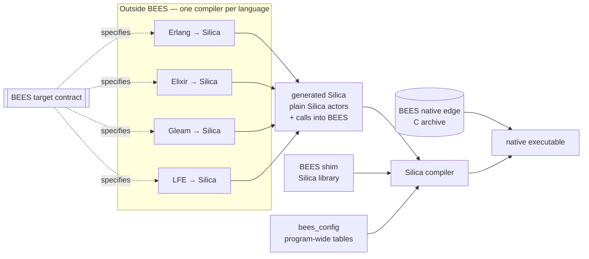
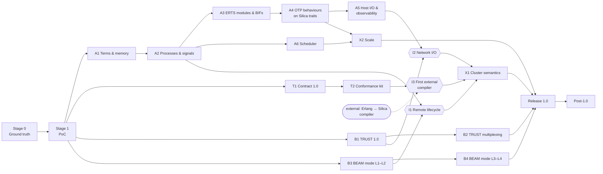

# BEES Roadmap — Proof of Concept to Complete Library

This document is the master plan for Project BEES, from proof of concept to a complete library. It also records, for
each gap between what Silica provides and what compiled BEAM-language code needs, who closes that gap.

It builds on [parallel-tracks.md](parallel-tracks.md), which remains authoritative on **how the work is organized**.
Companion documents:

- [gap-ledger.md](gap-ledger.md) — how each BEAM construct maps onto Silica, what Silica provides today, and who owns
  each gap.
- [inter-nodal-modes.md](inter-nodal-modes.md) — the two distribution modes: **SEMP/TRUST** (the default) and
  **standard BEAM distribution** (an explicit downgrade, and the mode for OTP interop).

All statements about Silica below were checked against the Silica repository at Apple Silicon **fixed point 1**
(commit `8aff9cdc5`, 2026-09-13; 33,824 trials green). Where the Silica specification and the implementation
disagree, this plan follows the implementation and the trials, and names the spec section it is waiting on.

---

## 1. Purpose

**BEES is the shim that lets BEAM languages be compiled to Silica and its constructs.** It is not an attempt to
reproduce the BEAM's code API for Silica programmers.

The BEAM has two parts, and each is replaced differently:

- **The emulator** (the bytecode interpreter) is replaced by **compilation**. Each BEAM language gets its own
  language-to-Silica compiler (Erlang, Elixir, Gleam, LFE). **Those compilers are outside the scope of BEES.** They
  are separate projects, and all of them target one BEES **target contract**.
- **The runtime system (ERTS)** is replaced by **Silica constructs wherever they exist** and by the **BEES shim
  wherever they do not.**
  - Silica supplies: processes (actors), supervision, gen_server, state machines, links, monitors, registries, and
    crash containment.
  - The BEES shim supplies the BEAM-specific parts of ERTS: **the multi-core scheduler** (D3), the term model, atoms,
    BIFs, ETS, timers, ports, and distribution (including SEMP/TRUST).

The **target contract** is the specification that lets independent compilers interoperate in one program. For
example, Elixir code calls Erlang's `lists` module, and both are compiled by different compilers. The contract fixes:

1. **Term representation.** The `bees_term` layout as Silica types, and the API for the shared atom table.
2. **Process model.** A BEAM process is a **plain Silica actor** whose messages are `bees_term` values. Code that does
   not fit Silica's once-per-message behaviour (a `receive` in the middle of a function, for example) is **reshaped by
   the compiler** (D1). The compiler keeps the paused computation in the actor's state and uses BEES's runtime
   helpers: the save queue for selective receive, the `after` timers, and memory evacuation.
3. **Calling convention.** How arguments are passed (including how more than 8 of them are packed), how results and
   exceptions are returned (D2), and how BIFs are named and called.
4. **Dynamic calls.** Each compiled module provides dispatch entries for `apply/3` and for its funs, together with a
   manifest. `bees_config` combines the manifests into a program-wide module table. BEES itself relies on that table
   (for TRUST, remote spawn, and `spawn/3`).
5. **OTP behaviours.** How `supervisor`, `gen_server` and `gen_statem` callback modules are expressed as
   implementations of Silica's `Supervisor`, gen_server and state-machine traits.
6. **Memory and preemption.** Where compilers place **evacuation points** and **yield points**, and which BEES API
   calls go at each (§4.2, §4.3). Both kinds of point sit at receive boundaries and tail calls, where the reshaped code
   holds every live value explicitly. At a yield point a process whose dispatch budget is spent suspends, exactly as
   it would at a `receive`, and the BEES scheduler runs something else.
7. **Naming.** A reserved module-name prefix for each language, plus BEES's own `bees_` prefix.
8. **Versioning.** The contract has its own version, and BEES reports which contract versions it supports.

No `.beam` file is loaded at run time and no bytecode is interpreted. Running Erlang/OTP systems are reached on the
wire, through standard BEAM distribution mode.

## 2. The ownership rule

BEES contains **only the portions of the BEAM that Silica lacks.** Every gap belongs to exactly one class:

| Class | Meaning | Owner | Examples |
| --- | --- | --- | --- |
| **U — Upstream** | Missing in Silica, but Silica is where it belongs. Either Silica's spec promises it and the runtime or compiler does not deliver it yet, or it belongs alongside what Silica already provides. A library cannot supply it. | The Silica repository. BEES tracks it as a prerequisite (Track S) and may contribute the work there. | **gen_server and state machines** (beside the `Supervisor` trait); links, monitors and trap-exit (stubs today); the **scheduler interface** that lets BEES run actors (today every actor is its own pthread); bignums; byte access; region release. |
| **B — BEES shim** | BEAM-specific runtime semantics with no place in Silica. | BEES, permanently. | **The multi-core scheduler** (D3); the `bees_term` model and Erlang term order; the atom table; BIFs; ETS; timers; the receive helpers; the process dictionary helpers; ETF; TRUST; BEAM distribution; `bees_config`. |
| **C — Compiler** | Supplied by how a language compiler translates code. | **Each language's compiler, outside BEES.** BEES specifies the obligation in the target contract. | Pattern matching; reshaping code around `receive`; `try`/`catch` lowering; defunctionalized funs; per-module dispatch entries; placing evacuation points; compiling each language's standard library, and OTP's Erlang libraries. |
| **E — Native edge** | Needs OS or cryptographic facilities Silica has no primitive for. One audited C archive behind `dangerous_bees_*` wrappers. Every function has a named retirement trigger. | BEES, temporarily. | TCP sockets, kqueue/epoll, TLS 1.3 engine, SHA-512, MD5, CSPRNG, monotonic clock. |

Consequences:

- **A BEAM process is a plain Silica actor** (D1, decided). BEES does not wrap actors, ship a second actor runtime, or
  keep a process-object layer. A local pid *is* an `actor_ref`.
- **BEES owns the scheduler** (D3, decided). It provides per-core carrier threads, run queues, work stealing,
  fairness, a dispatch budget standing in for reductions, priorities, affinity and migration, and a separate pool for
  blocking and dangerous actors. It schedules plain Silica actors through a **scheduler interface in the Silica
  runtime** (S-6). The Silica runtime keeps mailboxes, links, monitors and crash containment; BEES decides which actor
  runs, where, and for how long. The exact shape of that interface is D15.
- **OTP behaviours are Silica traits** (D5, decided). `gen_server`, `gen_statem` and `supervisor` callback modules are
  compiled to Silica's gen_server, state-machine and `Supervisor` traits, not to OTP's Erlang implementations of
  those behaviours.
- **OTP's Erlang libraries are compiled code, not BEES code.** Examples are `lists`, `gen_tcp`, `logger`, `erpc`,
  `global` and `pg`. The Erlang-to-Silica compiler compiles them. BEES provides the ERTS layer underneath them: BIFs,
  `prim_inet`, `prim_file`, and the distribution BIFs.
- **BEES is written in Silica, and the native edge is kept small.** "Don't roll your own crypto," and Silica's own TLS
  design note says to wrap a vetted engine (`tls_quantum_safe_future.md` §2–3).

## 3. Work streams and external dependencies

[parallel-tracks.md](parallel-tracks.md) defines Tracks A and B. This plan adds two more streams and names one
external dependency.

- **Track A — On-node shim** (BEES repo). Terms and memory; the runtime helpers for processes and signals on plain
  Silica actors; BIFs and ERTS-level modules; the mapping of OTP behaviours onto Silica traits; host I/O;
  observability; **the scheduler**.
- **Track B — Inter-nodal** (BEES repo). Node identity, the two distribution modes, and the wire codecs.
- **Track T — Target contract** (BEES repo). The contract specification and a **conformance kit**. The kit contains
  reference lowerings: hand-written Silica showing exactly what a compiler should emit for each construct. It also
  contains a test suite a compiler can run to check itself against BEES. Track T is also how BEES tests itself before
  any compiler exists.
- **Track S — Silica prerequisites** (Silica repo). The class-U items in the
  [gap ledger](gap-ledger.md#3-track-s--silica-prerequisites). BEES files each one as the smallest reasonable proposal,
  with a reproducing trial, and may implement it. That work follows Silica's own rules: fixed points, trial goldens,
  and `AI_POLICY.md` (human-vetted, no AI co-authors, smallest reasonable PRs).
- **External dependency: the language compilers.** They are not BEES work. BEES publishes the contract early (Stage
  0), keeps it stable, and uses the first available compiler (expected to be Erlang's) as its integration partner
  (I3).

Schedule risk lives in Track S and in the external compilers. Every milestone below lists what it blocks on.

## 4. Engineering constraints

These come from the FP1 toolchain as it actually is, not from the spec. Each one is a design rule for BEES, and for
the contract, until the named item removes it.

1. **Compiled BEAM code is dynamically typed, so every value is a `bees_term`.** BEES is largely monomorphic over one
   type, which makes Silica's lack of generics mostly irrelevant here. The contract specifies how compilers pack more
   than 8 arguments, because 8 is Silica's parameter limit.
2. **Memory must be reclaimed without a garbage collector.** Erlang code allocates constantly. Silica has regions and
   no GC, and today a per-actor arena is never reclaimed while the actor lives (a bump allocator with 8 MB
   committed).
   - *Rule:* a process's terms live in a region held in its actor state. At **evacuation points** the live terms are
     copied into a fresh region and the old region is released.
   - The contract places evacuation points at receive boundaries and tail calls. At those points every root is
     explicit in the reshaped code (D1): the paused computation, the save queue and the dictionary, or the arguments
     of the tail call.
   - This is copying collection at points where the compiler knows every root, so no stack scanning is needed. It
     **requires region release (S-15), which makes S-15 a 1.0 blocker.**
3. **One OS thread per actor, 512 KB stack, 1 GiB virtual reservation per actor.**
   - *Rule:* the PoC targets thousands of processes, not millions, and spike S3 measures the real ceiling.
   - This retires when the BEES scheduler (A6) runs many actors on each carrier thread, which needs the Silica
     scheduler interface (S-6).
   - Because of D1, a process holds no stack between messages. A scheduling step is therefore one message dispatch,
     or one dispatch-budget slice ended at a yield point, and an actor's stack is needed only while that step runs.
   - Deep body recursion in Erlang (`lists:map` over long lists) still needs growable stacks during a step: roadmap
     chunk 1, part of S-6.
4. **Erlang integers are arbitrary precision.** *Rule:* the PoC is limited to `int64`, and overflow raises
   `system_limit`. Conformance needs Silica bignums (S-11).
5. **Binaries and bit syntax need byte access that Silica does not have.** Silica has no `byte_at`, `substring` counts
   UTF-8 characters, and there is no `bxor`, no bit-casts and no width conversions. *Rule:* until S-4 lands,
   construction is pure Silica and matching and decoding run in the native edge. S-4 is a 1.0 blocker.
6. **Atoms are compile-time only in Silica, and in the implementation they are numbered per compilation unit.**
   - *Rule:* BEAM atoms live in one shared, bounded **BEES atom table**. It is seeded from every compiled module's
     manifest and grows at run time up to a cap.
   - Where generated code hands an atom to a Silica construct, it uses a Silica atom literal. Spike S2 must show
     that those literals survive `use` boundaries. If they don't, that is S-1, and it blocks everything.
7. **FFI taint and the `dangerous_` cascade.** Any app that uses BEES networking has a root module named
   `dangerous_*`. FFI-derived data may not be sent to an ordinary actor *directly*, but it **may be copied, and the
   copy sent**. *Rule:* everything that enters through the native edge reaches actors only through the **BEES copy
   gate** (`bees_ingress`). The gate enforces size caps, depth and count bounds, UTF-8 validity, and the atom-creation
   policy, and it builds fresh `bees_term` values. On any failure it drops the input silently toward the peer and
   writes an audit entry. It is a security boundary: fuzzed as one, with no other path in.
8. **There is no package mechanism.** *Rule:* every BEES module basename starts with `bees_` (or `dangerous_bees_`).
   `bees_config` assembles the consumer's `silica.config` from BEES and the compilers' output, and generates the
   program-wide module and atom tables. It retires with S-7.
9. **There is no CI.** Silica's "CI" is a human-run `make integrate` of about an hour on Apple Silicon. *Rule:* BEES
   keeps its own trial tree in Silica's format, pins the compiler generation it was verified with, and re-runs the
   tree on every compiler bump.

---

## 5. Milestones

Stages 0 and 1 are shared. After that, Tracks A, B and T run **in parallel**, with Track S alongside all of them.
They meet at three integration points (I1–I3), then converge in two cross-cutting milestones (X1, X2). Every
milestone closes with **trials**, not with code that merely compiles.

### Stage 0 — Ground truth

**Goal:** turn the unknowns in §4 into measured facts, set up the repository, and publish contract v0 so that
compiler projects can start.

- **R0.1 Repository and build.**
  - Source layout: `src/shim/`, `src/inter_nodal/`, `src/contracts/`, `contract/` (the specification and the
    conformance kit), `native/`, `trials/`, `tools/`.
  - A trial harness mirroring Silica's `trials/silica_compiler.mk` (the exit-75 reclaim loop, `.scout` and
    `.golden_fail` goldens).
  - `bees_config`.
- **R0.2 Feasibility spikes.** Each produces a short findings note under `development-plan/spikes/` and at least one
  trial.

  | Spike | Question | Kills or reshapes |
  | --- | --- | --- |
  | **S1 Trait mapping** | Can generated code implement Silica's `Supervisor` trait with `bees_term` state and messages, specialized at compile time, across the >32-unit reclaim path? What must Silica's gen_server and state-machine traits look like to host OTP callback modules? | Contract item 5; the shape of S-17 and S-19. |
  | **S2 Cross-unit atoms** | Does a Silica atom minted in one unit compare equal in another, as a message, a state field and a case pattern? | Everything. Failure means filing S-1 as a blocker. |
  | **S3 Actor ceiling** | Maximum live actors, and RSS/VA per actor, on 16 GB and 64 GB Macs; the cost of a spawn and of one message. | PoC scale; the urgency of S-6. |
  | **S4 Native edge** | A `dangerous_bees_native` wrapper (`clock_gettime`, `poll`) called from a `spawn_dangerous` worker. What do the naming cascade and the W4001 warning look like in a consumer app? | Every E-class component. |
  | **S5 Bytes** | How far can binaries and bit syntax get before S-4? | A1's binary scope before S-4. |
  | **S6 Terms and heap** | `bees_term` as a recursive tagged tuple (`recursive_tuple_specification.md`) in a region held in actor state. Can a region be released today? What does an evacuation cost? | Contract items 1 and 6; the urgency of S-15. |
  | **S7 Death observation** | Can BEES observe the death of an actor it does not supervise without runtime `monitor`? Expected: no, which confirms S-2. | Whether A2 can start before S-2. |
  | **S8 Copy gate** | FFI bytes → `bees_ingress` → fresh terms → actor. Confirm the taint checker accepts the gated path, and pin the rejection of direct forwarding in a `.golden_fail` trial. | Every remote message path. |
  | **S9 Reference lowerings** | Hand-lower four small Erlang programs into Silica exactly as the draft contract says a compiler should: a selective receive with `after` in mid-function (reshaped per D1), `try`/`catch` with stack traces, funs with `apply/3`, and binary matching. | Contract items 2–4; the first programs in the conformance kit. |
  | **S10 Exception representation** | Measure the candidate representations for D2 across BIF calls. | Contract item 3; input to the D2 discussion. |
  | **S11 Scheduler interface** | Can the Silica runtime let a BEES carrier thread run one message dispatch of a plain Silica actor, keeping Silica's mailbox, links, monitors and crash containment intact? Prototype it in a Silica branch and measure dispatch overhead against thread-per-actor. | D15; the shape of S-6; A6. |

- **R0.3 Contract v0.** Published as `contract/target-contract.md`, covering the eight items in §1, with the S9
  lowerings as worked examples. It starts from the construct mapping in [gap-ledger §1](gap-ledger.md). The
  maintainers of the language compiler projects are invited to review it.
- **R0.4 Track S filed.** Each S-item becomes a short Silica issue, with a failing trial where one can be written.

**Exit criteria:** all eleven spike notes are merged; D2 and D15 are recorded; contract v0 is published and has been
reviewed by at least one compiler project.

### Stage 1 — Proof of concept: "lowered Erlang on two nodes"

**Goal:** a thin vertical slice through the shim, the contract and both distribution modes. Scale and completeness
are out of scope. The PoC runs the **reference lowerings**: Silica written by hand exactly as contract v0 says a
compiler would emit. If an external Erlang-to-Silica compiler exists by then, the PoC runs its output too.

- **Track A slice: shim v0.**
  - `bees_term` for `int64`, atoms, tuples, lists, pids (local `actor_ref`s), and binaries as opaque values;
  - the shared atom table;
  - region evacuation at receive boundaries;
  - the receive helpers (save queue, `after` timer);
  - `bees_timer` over a native clock;
  - the BIFs the PoC programs use: `self/0`, `spawn/3` through the module table, `element/2`, `length/1`, send, and
    an `io:format/2` subset;
  - a `supervisor` callback module as a Silica `Supervisor` trait implementation.
- **Track T slice:** contract v0 exercised end to end by the reference lowerings, and `bees_config` generating the
  program-wide module and atom tables.
- **Track B slice.**
  - **TRUST:** lowered Erlang on node A calls `trpc:call(Host, Port, {M,F,A}, Args)`, the BEAM_SEMP API. Node B runs
    the allowlisted function through the module table, in a per-request worker. The call uses TLS 1.3 mTLS, the
    fingerprint whitelist, and the token path.
  - **BEAM mode:** a lowered Erlang process on a BEES node exchanges messages with a process on a real `erl -sname`
    node, in cleartext and loudly logged as a downgrade.

**Exit criteria:**

- Three Erlang programs produce the same output on BEES, as reference lowerings, as they do on the BEAM: a ping-pong
  with selective receive, a process ring, and a supervised worker restarted after a crash.
- Latency and per-process memory are measured.
- Every native-edge value reaches actors only through `bees_ingress`.
- The gap ledger is updated.

### Track A — On-node shim

| ID | Milestone | Contents | Blocks on | Exit criteria |
| --- | --- | --- | --- | --- |
| **A1** | Terms and memory | All `bees_term` types; Erlang term order and both equalities; the atom table with its cap; maps in term order over `wbt_map`; the bit-syntax runtime; bignums; `term_to_binary`/`binary_to_term` (with `safe`); the evacuation API. | S-4, S-11, S-15 | Term-order and bit-syntax trials derived from OTP's `erts` test suites. A long-running process's memory stays flat under load. |
| **A2** | Processes and signals | Runtime helpers for plain Silica actors: the save queue and `after` timers for reshaped `receive`; the process dictionary helpers; conversion between Silica's lifecycle events and Erlang terms (`'DOWN'`, `{'EXIT', Pid, Reason}`) on top of Silica's links, monitors and trap-exit (S-2, S-9); `exit/2`; `spawn`/`spawn_link`/`spawn_monitor`/`spawn_opt` BIFs over Silica spawn; registered names over the atom table; timers (`send_after`, `start_timer`, `cancel_timer`, `read_timer`); `process_info`, `processes/0`, `is_process_alive/1`. | S-2, S-9; S-3 (the native clock stands in) | Signal and receive trials derived from OTP's process and signal test suites, as reference lowerings. |
| **A3** | ERTS modules and BIFs | The `erlang` module's BIFs, in coverage tiers. `ets` (actor-owned tables over `wbt_map`, with documented concurrency differences). `persistent_term`, `atomics`, `counters`, `os`, `init` and the boot sequence, `code` over the program-wide module table. Handler back ends for compiled `logger`. `crypto` (hash, HMAC, `strong_rand_bytes`) over the native edge. | A1, A2; S-8 | Each BIF tier passes its trial subset. |
| **A4** | OTP behaviours on Silica traits | The contract's mapping of `gen_server`, `gen_statem` and `supervisor` onto Silica's traits, with reference lowerings. `proc_lib` and `sys` runtime support. Each documented difference from OTP (`hibernate`, `code_change`, `sys` debug) goes in the README. | S-17, S-19, S-2 | OTP behaviour test cases (derived from the gen_server, gen_statem and supervisor suites) pass as reference lowerings, and every exclusion is justified. |
| **A5** | Host I/O and observability | `bees_io`: one event loop per core (kqueue, epoll) in the native edge. `prim_inet` under compiled `gen_tcp`/`gen_udp`/`inet`, with `{active, once}` backpressure. `prim_file` under compiled `file`. Group leaders and the I/O protocol server. Telemetry. | S-8 | A lowered TCP echo server holds 1,000 concurrent connections; a slow reader pauses its socket. |
| **A6** | Scheduler | The BEES scheduler over the Silica scheduler interface: • one carrier thread per core; • per-core run queues and work stealing; • a dispatch budget standing in for reductions, enforced at the compilers' yield points (contract item 6); • process priorities; • affinity, placement and migration (the placement hook); • a separate pool for blocking and `spawn_dangerous` actors, including every native-edge worker; • overload protection and a runaway-dispatch watchdog; • scheduler statistics for `erlang:statistics/1` and `erlang:system_info/1`. | S-6 (scheduler interface), D15; A2 | Fairness trials: a CPU-bound process cannot starve its neighbours. Work stealing balances a skewed spawn. 100,000 live processes on a 16 GB Mac. |

### Track T — Target contract

| ID | Milestone | Contents | Blocks on | Exit criteria |
| --- | --- | --- | --- | --- |
| **T1** | Contract 1.0 | All eight contract items specified completely. That includes cross-language rules: one atom table, one module table, and one exception representation for every language, so that Elixir-compiled code can call Erlang-compiled code. It also includes a versioning and deprecation policy. | A1, A2, A4 | Every construct in gap-ledger §1 whose class is C has a contract section and a reference lowering. |
| **T2** | Conformance kit | The reference lowerings, plus a self-check suite that a compiler runs against BEES. The suite consists of source programs, expected output and contract assertions. It is packaged so that compiler projects can run it in their own CI. | T1 | The kit runs green on BEES's own reference lowerings. |

### Track B — Inter-nodal

Details are in [inter-nodal-modes.md](inter-nodal-modes.md).

| ID | Milestone | Contents | Blocks on | Exit criteria |
| --- | --- | --- | --- | --- |
| **B1** | TRUST 1.0 (single request) | The `trust/1` wire spec. `trpc:call/cast`, the BEAM_SEMP API. Server-side execution of allowlisted MFAs through the module table in a per-request worker. Whitelist, forbidden guard, suspicion and quarantine (D10), tokens, timeouts and limits, fail-fast config, audit log. Client side: A/AAAA resolution, stagger, per-server token cache, mutual pinning. | A2; S-17 soft (until Silica's state-machine trait lands, the connection FSM is a plain behaviour with a phase field); native TLS edge | A negative-path suite: every failure mode in the SEMP README closes the connection with no error body, writes a log entry, and changes suspicion. The frame fuzzer runs 24 hours with no crash. |
| **B2** | TRUST windowed multiplexing | Everything in the multiplexing design doc: session windows, GOAWAY, `max_inflight` with read-pause backpressure, a worker per request under a per-connection supervisor, cancel-by-close, metrics. Limits set to 1 must reproduce B1 exactly. | B1, A5 | That doc's acceptance criteria 1–10 as trials; p95 latency improves on B1. |
| **B3** | BEAM mode L1–L2 | EPMD (client, and an optional server). The version 6 handshake. ETF on the wire. Remote pids; sending to pids and registered names; links, monitors and exit signals across nodes; `nodedown`; net ticks. The distribution BIFs (`node/0`, `nodes/0`, `monitor_node/2`). | A2, S-2 | The interoperability matrix against OTP 26, 27 and 28 passes at L1 and L2. |
| **B4** | BEAM mode L3–L4 | SPAWN_REQUEST through the module table, subject to the scoped `spawn` option. A TLS distribution variant compatible with `inet_tls_dist`. The ERTS hooks that compiled `net_kernel`, `global` and `pg` need. | B3 | Remote spawn works in both directions against Erlang nodes; the TLS variant interoperates. With compiled OTP `erpc`/`global`/`pg`, the tests move into I3. |

### Integration points and cross-cutting milestones

| ID | What meets | Exit criteria |
| --- | --- | --- |
| **I1** Remote lifecycle | A2 signals × B3 control messages | A monitor on a remote pid fires with `noconnection` when the peer node dies, and with the peer's reason when the remote process dies. |
| **I2** Network I/O | A5 `bees_io` × B1 transport | TRUST and BEAM-mode sockets are ports on the A5 event loop. |
| **I3** First external compiler | T2 kit × the first language-to-Silica compiler (expected: Erlang) | The compiler passes the conformance kit. It compiles OTP's `stdlib`, the parts of `kernel` BEES supports, and `erpc`/`global`/`pg`. Selected OTP test suites pass on BEES at a published rate, and every failure is mapped to a ledger row or a compiler issue. |
| **X1** Cluster semantics | Membership, partitions, cluster observability | A three-node cluster mixing BEES and OTP nodes survives a partition and heals, with documented link and monitor behaviour. |
| **X2** Scale | The BEES scheduler (A6) tuned on Silica's growable stacks (S-6) | Published benchmarks against the BEAM on the same hardware: spawn rate, message latency, fairness under load, 1 million idle processes. |

### Release 1.0 — definition of "complete library"

1. **Contract.** Contract 1.0 is published, versioned and documented, and the conformance kit is available to
   compiler projects.
2. **Shim coverage.** Every gap-ledger row marked **1.0** is closed with trials, or explicitly moved out of scope in
   the README.
3. **Compiler integration.** At least one external compiler has passed I3.
4. **Silica constructs and the BEES scheduler.** BEAM processes are plain Silica actors, run by the BEES scheduler.
   Supervision, gen_server and state machines run on Silica's traits. BEES duplicates none of them.
5. **Distribution.** TRUST (B1, B2) passes its conformance, negative-path and fuzz suites. BEAM mode (B3, B4) passes
   the OTP interoperability matrix.
6. **Security review.** An external review has covered TRUST, `bees_ingress` and the native edge, and its findings
   are closed.
7. **Native edge.** It is minimal and audited, and every entry has a retirement trigger.
8. **Platforms.** Both Silica hosted AArch64 paths pass the BEES trial tree.

### Post-1.0

- **Hot code upgrade**, on Silica dynamic linking and `hot_swap` (S-12). The contract gains a module-versioning
  section.
- **NIFs**, as Silica FFI wrappers (D13).
- **TEMPUS.**
- **`trust/2`**, if D9 says so.
- **Ports** to more Silica emitters.
- **Native-edge retirement:** TLS moves to Silica TLS intrinsics (S-13), constant-time comparison to `CtMask` (S-14).

---

## 6. Decisions

Every decision has a status: **Decided** (with the date), **Open — under discussion**, or **Open**. For an open
decision, the third column holds a *proposal* to start the discussion from; it is not a recommendation that anything
depends on yet.

| ID | Decision | Status and outcome, or proposal | Notes |
| --- | --- | --- | --- |
| **D1** | Process execution model. | **Decided 2026-09-14:** processes are plain Silica actors, and the compiler reshapes whatever does not fit Silica's once-per-message behaviour. BEES provides runtime helpers (save queue, `after` timers, evacuation) and does not wrap actors. | Needs no language change, because Silica forbids user `recv()` (§15.1.2). Every root is explicit at evacuation and yield points (§4.2). A process holds no stack between messages, so a scheduling step is one dispatch. |
| **D2** | How exceptions cross the contract boundary: BIF failures, `throw`/`error`/`exit`, stack traces. | **Open — under discussion.** Proposal: result-style values, where a call returns either a value or an exception triple `{Class, Reason, Stacktrace}`. Compilers may lower `try`/`catch` however they like, as long as they honour this at contract boundaries. | Spike S10 supplies measurements. |
| **D3** | Where the multi-core scheduler lives. | **Decided 2026-09-14: in BEES.** Carrier threads, run queues, work stealing, the dispatch budget, priorities, affinity, and the blocking pool are all BEES (A6). They run over a scheduler interface in the Silica runtime (S-6). | How BEES drives plain Silica actors is D15. |
| **D4** | Language compilers. | **Decided 2026-09-14: out of scope.** Each language has its own language-to-Silica compiler, and BEES owns the target contract they share. | — |
| **D5** | OTP behaviours. | **Decided 2026-09-14:** gen_server and state machines are Silica constructs beside the `Supervisor` trait (S-17, S-19). | — |
| **D6** | TLS engine for the native edge. | **Open — under discussion.** Proposal: rustls through `rustls-ffi`, unless Silica's own TLS work (S-13) settles on s2n. | rustls is memory-safe and TLS 1.3 only, supports hybrid X25519MLKEM768 and mTLS with a custom verifier, and exposes the peer certificate DER. The Rust toolchain is needed only to build the native edge. |
| **D7** | How the two modes coexist on one node. | **Open — under discussion.** Proposal: TRUST is on by default. BEAM mode is off by default and is a separate listener, enabled explicitly, with a downgrade banner. Both may run at once. | Based on parallel-tracks.md, "Opting down to BEAM-equivalent security." |
| **D8** | TRUST payload encoding. | **Open — under discussion.** Proposal: ETF decoded with `safe` semantics, meaning only existing atoms and no funs. | This is what the BEAM_SEMP reference does. |
| **D9** | Should TRUST gain remote links and monitors (`trust/2`)? | **Open — under discussion.** Proposal: not for 1.0; revisit after X1. | TRUST's model is short, permissioned sessions. |
| **D10** | Quarantine recovery. | **Open — under discussion.** Proposal: an operator reset only, while suspicion below the limit decays on successful calls. | The SEMP README contradicts itself on this point. |
| **D11** | Whitelist key. | **Open — under discussion.** Proposal: SHA-512 of the full certificate DER, with a documented rotation procedure. | The SEMP README describes the key two different ways. |
| **D12** | TEMPUS in 1.0? | **Open — under discussion.** Proposal: post-1.0. | — |
| **D13** | NIFs. | **Open — under discussion.** Proposal: not in 1.0. After 1.0, `erlang:load_nif` binds statically linked Silica FFI wrappers. | — |
| **D14** | Which OTP release's semantics the shim's BIFs follow. | **Open — under discussion.** Proposal: one named release for 1.0, chosen at Stage 0. | BIF semantics drift between OTP releases. |
| **D15** | How the BEES scheduler drives plain Silica actors. | **Open.** Proposal: the Silica runtime keeps each actor's mailbox, links, monitors, supervision and crash containment. Through a scheduler interface (S-6) it reports "actor X became runnable" to BEES, and exposes "run one dispatch of actor X on this thread." BEES owns the carrier threads, the queues, work stealing, and budgets. | This follows from D1 and D3. Spike S11 prototypes it. |

## 7. Top risks

| Risk | Effect | Mitigation |
| --- | --- | --- |
| No external compiler is ready when the shim is. | I3 and 1.0 slip, and the shim is validated only by hand-written lowerings. | Publish contract v0 at Stage 0; the conformance kit makes a compiler's first steps cheap; the reference lowerings keep BEES testable on its own. |
| The contract underspecifies something two compilers then do differently. | Code compiled by different compilers cannot interoperate. | Cross-language rules in T1; the conformance kit includes cross-language programs; the contract is versioned. |
| Region evacuation is too slow, or S-15 is late. | Long-lived processes cannot run. | Spike S6 first; push S-15 early; tune evacuation thresholds in A1. |
| Track S items slip or are declined (especially S-1, S-2, S-4, S-6, S-11, S-15). | Stage 1, A1, A2, A6 and conformance stall. | File them early with failing trials, and offer to implement them. For S-6, spike S11 produces a working prototype of the interface to propose. |
| The Silica scheduler interface (S-6) turns out too narrow for a BEAM-grade scheduler. | A6 cannot deliver fairness or scale. | Spike S11 measures before A6 starts. The requirements come from A6's exit criteria, not from Silica's current runtime. |
| A defect in `bees_ingress`. | Remote input reaches processes unvalidated. | One gate, no bypass, kept small, fuzzed per validator, inside the external review. |
| Silent miscompilation in the Silica compiler, amplified by the volume of generated code. | Wrong answers even with green trials. | Differential testing against a reference BEAM; minimize any reproducer to a Silica trial immediately; pin compiler generations. |
| OTP semantics drift. | BIFs diverge from newer OTP releases. | D14 pins one release; the interop matrix is re-run for each new OTP release. |
